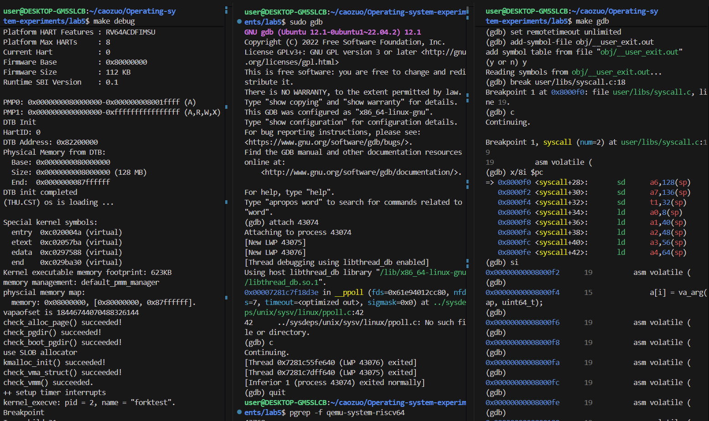
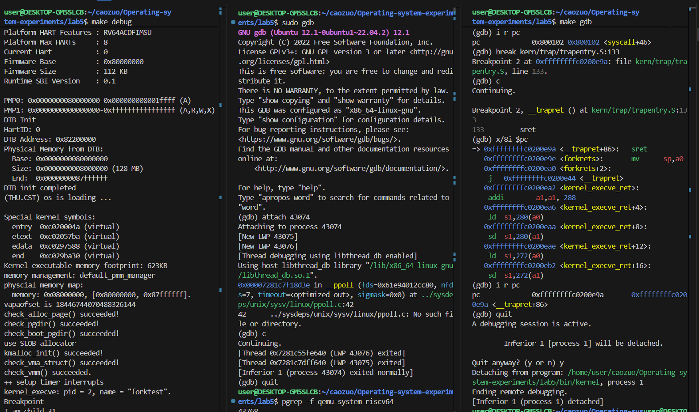

## 练习0：填写已有实验

我们在已有的基础上，做一些修改：

### alloc_proc函数

我们在已有的函数基础上主要添加了 wait_state ，*cptr , *yptr , *optr 的初始化操作，代码如下所示：

```c
static struct proc_struct *
alloc_proc(void) {
   struct proc_struct *proc = kmalloc(sizeof(struct proc_struct));
   if (proc != NULL) {
       proc->state = PROC_UNINIT;
       proc->pid = -1;
       proc->runs = 0;
       proc->kstack = 0;
       proc->need_resched = 0;
       proc->parent = NULL;
       proc->mm = NULL;
       memset(&(proc->context), 0, sizeof(struct context));
       proc->tf = NULL;
       proc->cr3 = boot_cr3;
       proc->flags = 0;
       memset(proc->name, 0, PROC_NAME_LEN);
       proc->wait_state = 0;
       proc->cptr = NULL;
       proc->optr = NULL;
       proc->yptr = NULL;
   }
   return proc;
}
```

### do_fork函数

我们在之前的基础上添加了 proc->parent = current ，将当前的进程设置为子进程的父进程。assert(current->wait_state == 0) 确保了当前进程的等待状态为0。 set_links(proc) 设置了进程间的关系。

```c
int do_fork(uint32_t clone_flags, uintptr_t stack, struct trapframe *tf) {
    int ret = -E_NO_FREE_PROC;
    struct proc_struct *proc;
    if (nr_process >= MAX_PROCESS) {
         goto fork_out;
    }
    ret = -E_NO_MEM;
    if((proc = alloc_proc()) == NULL)
    {
         goto fork_out;
    }
    proc->parent = current; // 添加
    assert(current->wait_state == 0);
    if(setup_kstack(proc) != 0)
    {
        goto bad_fork_cleanup_proc;
    }
    ;
    if(copy_mm(clone_flags, proc) != 0)
    {
        goto bad_fork_cleanup_kstack;
    }
    copy_thread(proc, stack, tf);
    bool intr_flag;
    local_intr_save(intr_flag);
    {
        int pid = get_pid();
        proc->pid = pid;
        hash_proc(proc);
        set_links(proc);
    }
    local_intr_restore(intr_flag);
    wakeup_proc(proc);
    ret = proc->pid;
fork_out:
    return ret;
bad_fork_cleanup_kstack:
    put_kstack(proc);
bad_fork_cleanup_proc:
    kfree(proc);
    goto fork_out;
}ree(proc);
goto fork_out;
}
```

## 练习1: 加载应用程序并执行（需要编码）
do_execve函数调用load_icode（位于kern/process/proc.c中）来加载并解析一个处于内存中的ELF执行文件格式的应用程序。你需要补充load_icode的第6步，建立相应的用户内存空间来放置应用程序的代码段、数据段等，且要设置好proc_struct结构中的成员变量trapframe中的内容，确保在执行此进程后，能够从应用程序设定的起始执行地址开始执行。需设置正确的trapframe内容。

请在实验报告中简要说明你的设计实现过程。

请简要描述这个用户态进程被ucore选择占用CPU执行（RUNNING态）到具体执行应用程序第一条指令的整个经过。

#### 设计实现过程
tf->gpr.sp = USTACKTOP：
- 根据 memlayout.h 定义，用户栈从 USTACKTOP 向下生长，栈顶初始地址为 USTACKTOP，确保用户程序能正常使用栈空间。

tf->epc = elf->e_entry：
- elf->e_entry 是 ELF 文件的链接入口地址，即应用程序编译链接后指定的起始执行地址，需将其设为用户态程序的 PC 初始值。

tf->status = (sstatus & ~SSTATUS_SPP) | SSTATUS_SPIE：
- 清除 SSTATUS_SPP 位（值为 0）：表示当前特权级为用户态（SSTATUS_SPP=1 时为内核态），符合用户程序执行环境。
- 设置 SSTATUS_SPIE 位（值为 1）：允许用户态中断，sret 指令后会将 SPIE 映射到 SIE 位，启用中断响应。
- 保留原 sstatus 其他位：避免破坏内核态时的其他状态设置。

#### 用户态进程从 RUNNING 态到执行应用程序第一条指令的经过
- 进程调度触发：调度器（schedule 函数）选择该用户态进程，将其状态设为 RUNNING，调用proc_run函数。

- 页目录加载：proc_run中执行lsatp(next->pgdir)，将用户进程的页目录物理地址加载到 satp 寄存器，启用该进程的虚拟内存映射。

- 上下文切换：调用switch_to函数，保存当前运行进程的上下文（寄存器状态），恢复该用户进程的上下文（proc->context）。此时进程的程序计数器（ra）指向forkret函数。

- 恢复 trapframe：forkret函数调用forkrets(current->tf)，从进程的 trapframe 中恢复用户态寄存器值（包括之前设置的 sp、epc 等）。

- 特权级切换：执行sret指令，将 trapframe 中的status加载到 sstatus 寄存器，切换到用户态（SSTATUS_SPP=0），同时将epc加载到程序计数器（pc）。

- 执行第一条指令：pc 指向elf->e_entry（应用程序入口地址），CPU 开始执行用户态程序的第一条指令，进程正式进入用户态执行。

## 练习2: 父进程复制自己的内存空间给子进程（需要编码）

创建子进程的函数do_fork在执行中将拷贝当前进程（即父进程）的用户内存地址空间中的合法内容到新进程中（子进程），完成内存资源的复制。具体是通过copy_range函数（位于kern/mm/pmm.c中）实现的，请补充copy_range的实现，确保能够正确执行。

请在实验报告中简要说明你的设计实现过程。

```c
int copy_range(pde_t *to, pde_t *from, uintptr_t start, uintptr_t end, bool share) {
    assert(start % PGSIZE == 0 && end % PGSIZE == 0);
    assert(USER_ACCESS(start, end));
    do {
        pte_t *ptep = get_pte(from, start, 0), *nptep;
        if (ptep == NULL) {
            start = ROUNDDOWN(start + PTSIZE, PTSIZE);
            continue;
        }
        if (*ptep & PTE_V) {
            if ((nptep = get_pte(to, start, 1)) == NULL) {
                return -E_NO_MEM;
            }
            uint32_t perm = (*ptep & PTE_USER);
            struct Page *page = pte2page(*ptep);
            struct Page *npage = alloc_page();
            assert(page != NULL);
            assert(npage != NULL);
            int ret = 0;
            uintptr_t *src = page2kva(page); // 获取src源地址的内核虚拟地址
            uintptr_t *dst = page2kva(npage); // 获取dst目的地址的内核虚拟地址
            memcpy(dst, src, PGSIZE); // 拷贝内存，将src的内存复制到dst中
            ret = page_insert(to, npage, start, perm); // 最后将拷贝完的页插入到页表中即
            assert(ret == 0);
        }
        start += PGSIZE;
    } while (start != 0 && start < end);
    return 0;
}
```

#### 设计实现说明

1. 按页复制：虚拟地址范围按 PGSIZE（4KB）拆分，确保内存对齐，符合 ucore 的分页管理机制。
  
2. 内核虚拟地址访问：物理页无法直接访问，通过 page2kva 将 Page 结构体转换为内核虚拟地址，再用 memcpy 复制内容，避免地址访问错误。
  
3. 权限继承：直接复用父进程 pte 的用户态权限（PTE_USER 相关位），确保子进程对该页的访问权限与父进程一致。
  
4. 页表映射建立：通过 page_insert 将子进程的新物理页与虚拟地址绑定，完成地址空间复制。
  

### **如何设计实现`Copy on Write`机制？给出概要设计，鼓励给出详细设计。**

> Copy-on-write（简称COW）的基本概念是指如果有多个使用者对一个资源A（比如内存块）进行读操作，则每个使用者只需获得一个指向同一个资源A的指针，就可以该资源了。若某使用者需要对这个资源A进行写操作，系统会对该资源进行拷贝操作，从而使得该“写操作”使用者获得一个该资源A的“私有”拷贝—资源B，可对资源B进行写操作。该“写操作”使用者对资源B的改变对于其他的使用者而言是不可见的，因为其他使用者看到的还是资源A。

### 详细设计：

#### 1.fork 阶段：共享物理页面（copy_range 修改）

在 ucore 中，`do_fork` 通过 `copy_range` 函数复制父进程的用户地址空间。

##### 原始行为（非 COW）：

- 为子进程分配新物理页
  
- 复制父进程页面内容
  
- 建立新的页表映射
  

##### COW 改进行为：

在 `copy_range(to, from, start, end, share)` 中：

- 当 `share == true`：
  
  1. **不分配新物理页**
    
  2. 父子进程页表项都指向同一物理页
    
  3. 清除写权限（`PTE_W`），保留读权限
    
  4. 增加该物理页的引用计数
    

此时，父子进程共享同一物理页面，但均不可写。

#### 2. 页故障触发阶段

当进程对共享只读页面进行写操作时：

- CPU 检测到写访问违反页权限
  
- 触发 **store page fault**
  
- 控制流进入内核的 page fault 异常处理逻辑
  

#### 3. Page Fault 阶段：执行 Copy-on-Write

在`do_pgfault`处理函数中来判断是否为 COW 触发的写异常。

- fault 原因：写访问（store fault）
  
- 页表项存在（PTE_V）
  
- 页表项无写权限（`!PTE_W`）
  
- 页面引用计数 > 1（说明被共享）
  

##### 执行 COW 操作：

1. 分配新的物理页面 `new_page`
  
2. 将原页面内容复制到新页面
  
3. 更新当前进程页表项：映射到新页面并且恢复写权限（PTE_W）
  
4. 原物理页引用计数减 1
  

然后，我们的写操作就可以正常完成了。

## 练习3: 阅读分析源代码，理解进程执行 fork/exec/wait/exit 的实现，以及系统调用的实现（不需要编码）

#### 请在实验报告中简要说明你对 fork/exec/wait/exit函数的分析。

我们直接针对do_fork() , do_execve() , do_wait() , do_exit()函数进行分析：

##### do_fork()

```c
int do_fork(uint32_t clone_flags, uintptr_t stack, struct trapframe *tf) {
    int ret = -E_NO_FREE_PROC;
    struct proc_struct *proc;
    if (nr_process >= MAX_PROCESS) {
    goto fork_out;
    }
    ret = -E_NO_MEM;
    if((proc = alloc_proc()) == NULL)
    {
    goto fork_out;
    }
    proc->parent = current; // 添加
    assert(current->wait_state == 0);
    if(setup_kstack(proc) != 0)
    {
    goto bad_fork_cleanup_proc;
    }
    ;
    if(copy_mm(clone_flags, proc) != 0)
    {
    goto bad_fork_cleanup_kstack;
    }
    copy_thread(proc, stack, tf);
    bool intr_flag;
    local_intr_save(intr_flag);
    {
    int pid = get_pid();
    proc->pid = pid;
    hash_proc(proc);
    set_links(proc);
    }
    local_intr_restore(intr_flag);
    wakeup_proc(proc);
    ret = proc->pid;
fork_out:
    return ret;
bad_fork_cleanup_kstack:
    put_kstack(proc);
bad_fork_cleanup_proc:
    kfree(proc);
    goto fork_out;
}
```

**分析：**`do_fork` 是内核中创建新进程的核心函数，其整体流程是：**分配并初始化子进程控制块 → 复制/共享地址空间 → 复制执行上下文 → 将子进程加入调度体系并唤醒运行**。函数首先检查进程数上限并分配 `proc_struct`，设置父子关系；随后为子进程分配内核栈，并通过 `copy_mm` 复制父进程的内存管理结构，这是 COW 发生的关键位置；接着用 `copy_thread` 复制父进程的陷入帧和内核上下文，使子进程从“看起来像刚从 `fork` 返回”的状态开始执行。最后在关中断保护下分配 PID、加入进程表与调度队列，并唤醒子进程进入就绪态；若任一步失败，则按路径回收已分配资源并返回错误码。

##### do_execve()

```c
int do_execve(const char *name, size_t len, unsigned char *binary, size_t size) {
    struct mm_struct *mm = current->mm;
    if (!user_mem_check(mm, (uintptr_t)name, len, 0)) {
    return -E_INVAL;
    }
    if (len > PROC_NAME_LEN) {
    len = PROC_NAME_LEN;
    }
    char local_name[PROC_NAME_LEN + 1];
    memset(local_name, 0, sizeof(local_name));
    memcpy(local_name, name, len);
    if (mm != NULL) {
    cputs("mm != NULL");
    lcr3(boot_cr3);
    if (mm_count_dec(mm) == 0) {
    exit_mmap(mm);
    put_pgdir(mm);
    mm_destroy(mm);
    }
    current->mm = NULL;
    }
    int ret;
    if ((ret = load_icode(binary, size)) != 0) {
    goto execve_exit;
    }
    set_proc_name(current, local_name);
    return 0;
execve_exit:
    do_exit(ret);
    panic("already exit: %e.\n", ret);
}
```

**分析：**`do_execve` 的作用是**用一个新的用户程序替换当前进程的地址空间并从该程序重新开始执行**。函数首先在用户态地址空间中检查并安全拷贝程序名；随后若当前进程已有用户地址空间（`mm != NULL`），则切换回内核页表并递减 `mm` 引用计数，必要时释放原进程的虚拟内存映射、页表和 `mm_struct`，实现“彻底抛弃旧程序”。接着调用 `load_icode` 解析并加载内存中的 ELF 程序，建立新的用户地址空间并初始化陷入帧（入口地址、用户栈等），使进程在返回用户态后从新程序的入口开始执行；最后更新进程名并返回。若加载失败，则直接调用 `do_exit` 终止当前进程。

##### do_wait()

```c
int do_wait(int pid, int *code_store) {
    struct mm_struct *mm = current->mm;
    if (code_store != NULL) {
        if (!user_mem_check(mm, (uintptr_t)code_store, sizeof(int), 1)) {
            return -E_INVAL;
        }
    }
    struct proc_struct *proc;
    bool intr_flag, haskid;
repeat:
    haskid = 0;
    if (pid != 0) {
        proc = find_proc(pid);
        if (proc != NULL && proc->parent == current) {
            haskid = 1;
            if (proc->state == PROC_ZOMBIE) {
                goto found;
            }
        }
    }
    else {
        proc = current->cptr;
        for (; proc != NULL; proc = proc->optr) {
            haskid = 1;
            if (proc->state == PROC_ZOMBIE) {
                goto found;
            }
        }
    }
    if (haskid) {
        current->state = PROC_SLEEPING;
        current->wait_state = WT_CHILD;
        schedule();
        if (current->flags & PF_EXITING) {
            do_exit(-E_KILLED);
        }
        goto repeat;
    }
    return -E_BAD_PROC;
found:
    if (proc == idleproc || proc == initproc) {
        panic("wait idleproc or initproc.\n");
    }
    if (code_store != NULL) {
        *code_store = proc->exit_code;
    }
    local_intr_save(intr_flag);
    {
        unhash_proc(proc);
        remove_links(proc);
    }
    local_intr_restore(intr_flag);
    put_kstack(proc);
    kfree(proc);
    return 0;
}
```

**分析：**`do_wait` 用于实现 **wait/waitpid 语义**：当前进程等待其子进程退出并回收其资源。函数首先检查 `code_store` 是否为合法的用户可写地址；随后根据 `pid` 的取值决定等待**指定子进程**（`pid != 0`）还是**任意子进程**（`pid == 0`），遍历子进程链表查找处于 `PROC_ZOMBIE` 状态的子进程。若存在子进程但尚未退出，则将当前进程置为 `PROC_SLEEPING`，设置等待原因并调用 `schedule()` 主动让出 CPU，待被唤醒后继续检查；若不存在任何子进程则返回错误。找到僵尸子进程后，拷贝其退出码，安全地从进程管理结构中移除该子进程并释放其内核栈和进程控制块，完成对子进程的“回收”。

##### do_exit()

```c
int do_exit(int error_code) {
    if (current == idleproc) {
        panic("idleproc exit.\n");
    }
    if (current == initproc) {
        panic("initproc exit.\n");
    }
    struct mm_struct *mm = current->mm;
    if (mm != NULL) {
        lcr3(boot_cr3);
        if (mm_count_dec(mm) == 0) {
            exit_mmap(mm);
            put_pgdir(mm);
            mm_destroy(mm);
        }
        current->mm = NULL;
    }
    current->state = PROC_ZOMBIE;
    current->exit_code = error_code;
    bool intr_flag;
    struct proc_struct *proc;
    local_intr_save(intr_flag);
    {
        proc = current->parent;
        if (proc->wait_state == WT_CHILD) {
            wakeup_proc(proc);
        }
        while (current->cptr != NULL) {
            proc = current->cptr;
            current->cptr = proc->optr;

            proc->yptr = NULL;
            if ((proc->optr = initproc->cptr) != NULL) {
                initproc->cptr->yptr = proc;
            }
            proc->parent = initproc;
            initproc->cptr = proc;
            if (proc->state == PROC_ZOMBIE) {
                if (initproc->wait_state == WT_CHILD) {
                    wakeup_proc(initproc);
                }
            }
        }
    }
    local_intr_restore(intr_flag);
    schedule();
    panic("do_exit will not return!! %d.\n", current->pid);
}
```

**分析：**`do_exit` 用于实现进程退出的完整内核逻辑：首先禁止 `idleproc` 和 `initproc` 退出；随后释放当前进程的用户地址空间（切换回内核页表、减少 `mm` 引用计数，必要时销毁页表和 VMA），并将进程状态设置为 `PROC_ZOMBIE`，记录退出码。接着在关中断的临界区内唤醒正在等待子进程的父进程，并将当前进程的所有子进程重新托管给 `initproc`（同时处理僵尸子进程的唤醒问题），确保进程树一致性。最后调用 `schedule()` 让出 CPU，当前进程不再运行，仅等待被父进程通过 `do_wait` 回收，其控制流不会再返回。

#### 请分析fork/exec/wait/exit的执行流程。重点关注哪些操作是在用户态完成，哪些是在内核态完成？内核态与用户态程序是如何交错执行的？内核态执行结果是如何返回给用户程序的？

执行流程在上面内容中已经分析过，在此不再赘述。

在 ucore 中，**用户态**主要负责执行普通应用程序代码，以及发起系统调用（如 `fork`、`exec`、`wait`、`exit`），用户程序只进行参数准备并通过 `ecall / ebreak` 指令主动陷入内核；**内核态**则完成所有特权操作，包括进程创建与销毁、虚拟内存管理、页表修改、程序加载、进程调度以及异常和中断处理等核心功能。

用户态与内核态通过**异常机制交错执行**：用户态执行到系统调用指令时触发异常，CPU 保存现场并切换到内核态执行系统调用处理函数；内核完成工作后，通过修改进程的 `trapframe`，再由 `sret` 指令返回用户态继续执行。系统调用的执行结果正是通过 `trapframe` 中寄存器的更新传递给用户程序，从而实现内核态到用户态的受控返回。

#### 请给出ucore中一个用户态进程的执行状态生命周期图（包执行状态，执行状态之间的变换关系，以及产生变换的事件或函数调用）。（字符方式画即可）

```
UNUSED
  │ alloc_proc()
  ▼
EMBRYO
  │ do_fork()
  ▼
RUNNABLE ── schedule() ──▶ RUNNING
   ▲          │   │
   │          │   ├─ do_exit() ─▶ ZOMBIE ── do_wait() ─▶ UNUSED
   │          │
   │      do_wait()
   │          ▼
   └──── wakeup_proc() ── SLEEPING
```

**总结**：core 中进程的所有状态转换均在**内核态**完成，用户态程序仅通过系统调用触发相应内核操作。调度器、进程管理和状态切换逻辑共同保证了用户进程在 RUNNABLE、RUNNING、SLEEPING 和 ZOMBIE 等状态之间的正确转换，构成了一个完整且可控的用户态进程生命周期。

## 扩展练习 Challenge

### 实现 Copy on Write （COW）机制

给出实现源码,测试用例和设计报告（包括在cow情况下的各种状态转换（类似有限状态自动机）的说明）。

这个扩展练习涉及到本实验和上一个实验“虚拟内存管理”。在ucore操作系统中，当一个用户父进程创建自己的子进程时，父进程会把其申请的用户空间设置为只读，子进程可共享父进程占用的用户内存空间中的页面（这就是一个共享的资源）。当其中任何一个进程修改此用户内存空间中的某页面时，ucore会通过page fault异常获知该操作，并完成拷贝内存页面，使得两个进程都有各自的内存页面。这样一个进程所做的修改不会被另外一个进程可见了。请在ucore中实现这样的COW机制。

由于COW实现比较复杂，容易引入bug，请参考 [https://dirtycow.ninja/](https://dirtycow.ninja/) 看看能否在ucore的COW实现中模拟这个错误和解决方案。需要有解释。

这是一个big challenge.

#### **`Copy on Write`机制原理：**

**写时复制（Copy-On-Write）是一种延迟内存拷贝的优化机制。在进程创建（如 `fork`）时，父子进程并不立即复制各自的物理内存页，而是先共享同一份物理页**，并将这些页统一设置为**只读**。这样可以避免大量在后续并不会被使用的内存拷贝，从而降低内存占用并提升进程创建效率。

当父或子进程中**任意一方第一次尝试写共享页**时，CPU 会因为写只读页而触发页异常，内核在页异常处理过程中才真正分配新的物理页、复制原页内容，并将当前进程的页表指向新页、恢复写权限。这样既保证了进程之间的内存隔离，又实现了“按需拷贝”的高效内存管理。

我们并没有完整实现并测试该challenge，但是实现了该COW机制的完整逻辑框架，下面是该框架的代码设计报告：

```c
int copy_range(pde_t *to, pde_t *from, uintptr_t start, uintptr_t end,
               bool share) {
    assert(start % PGSIZE == 0 && end % PGSIZE == 0);
    assert(USER_ACCESS(start, end));
    // copy content by page unit.
    do {
        // call get_pte to find process A's pte according to the addr start
        pte_t *ptep = get_pte(from, start, 0), *nptep;
        if (ptep == NULL) {
            start = ROUNDDOWN(start + PTSIZE, PTSIZE);
            continue;
        }
        // call get_pte to find process B's pte according to the addr start. If
        // pte is NULL, just alloc a PT
        if (*ptep & PTE_V) {
            if ((nptep = get_pte(to, start, 1)) == NULL) {
                return -E_NO_MEM;
            }
            uint32_t perm = (*ptep & PTE_USER);
            // get page from ptep
            struct Page *page = pte2page(*ptep);
            int ret = 0;
            //==========COW机制初始状态实现===========
            if(share)
            {
                // 物理页面共享，并设置两个PTE上的标志位为只读，并添加 COW 标志
                page_insert(from, page, start, (perm & ~PTE_W) | PTE_COW);
                ret = page_insert(to, page, start, (perm & ~PTE_W) | PTE_COW);
            }else{//原来的复制逻辑
                struct Page *npage = alloc_page();
                assert(page != NULL);
                assert(npage != NULL);
                uintptr_t* src = page2kva(page);
                uintptr_t* dst = page2kva(npage);
                memcpy(dst, src, PGSIZE);
                // 将目标页面地址设置到PTE中
                ret = page_insert(to, npage, start, perm);
            }
            assert(ret == 0);
        }
        start += PGSIZE;
    } while (start != 0 && start < end);
    return 0;
}
```

对于copy_range()函数，我们主要修改了后半部分内容以实现COW机制的初始状态（共享+只读）设置：首先通过if(share)判断是否需要在进程间共享页面，如果需要则进行物理页面共享，并且把两个进程的权限都设置为只读，然后设置COW标志，表示该处的进程共享的是COW机制下的页面。如果不需要共享的话则按照原理的逻辑，重新复制一份新的物理页面，并且把父进程的页面内容复制到子进程中。

```c
struct Page *page = NULL;
/* 情况 1：页面存在 */
if (*ptep & PTE_V) {
    /* 子情况 1.1：写一个只读页 */
    if (!(*ptep & PTE_W)) {

        /* 1.1.1：这是一个 COW 页面 */
        if (*ptep & PTE_COW) {
            page = pte2page(*ptep);
            if (page_ref(page) > 1) {
                // 真正的 COW：分配新页 + 拷贝
                struct Page *newPage =
                    pgdir_alloc_page(mm->pgdir, addr, perm);
                memcpy(page2kva(newPage),
                       page2kva(page), PGSIZE);
            } else {
                // 只有当前进程引用，直接恢复写权限
                page_insert(mm->pgdir, page, addr, perm);
            }
        }
        /* 1.1.2：不是 COW，只读保护错误 */
        else {
            return -E_INVAL; // 或 panic
        }
    }

    /* 子情况 1.2：其他合法页 */
}

/* 情况 2：页面不存在 → swap / demand paging */
else {
    if (swap_init_ok) {
        swap_in(mm, addr, &page);
        page_insert(mm->pgdir, page, addr, perm);
    } else {
        goto failed;
    }
}
```

这部分是位于do_pgfault()中的代码，完成了针对COW机制的共享进程写数据的问题。当进程要写共享页面时，会触发CAUSE_STORE_PAGE_FAULT错误 -> 调用pgfault_handler()处理 -> 调用do_pgfault()处理，最后在do_pgfault()中实现核心处理。我们首先判断页面存在且只读，然后根据PTE_COW标志位来判断该写入共享页面情况是不是COW情况，这是因为正常情况下也会出现多个进程共享一个物理页面的情况。当确定是COW页面后，我们对有写入需求的进程分配新的物理页面，并且把父进程的页面内容复制到子进程中，这样就实现了COW机制的写入处理的核心操作。

### 说明该用户程序是何时被预先加载到内存中的？与我们常用操作系统的加载有何区别，原因是什么？

#### **用户程序的加载时机：**

在 ucore 中，用户程序不是用户主动运行时才加载的，而是在内核启动后的初始化阶段被 **预先加载到内存**。内核先创建 `idleproc`（第一个内核线程）和 `init_main`（第二个内核线程），再通过 `init_main` 创建 `user_main` 内核线程，`user_main` 会调用 `do_execve()` 将用户程序的二进制内容映射到内存，并初始化用户栈和寄存器状态。

#### **加载方式与常规操作系统的区别：**

常规操作系统（如 Linux）会在用户主动执行程序时，通过文件系统从磁盘读取 ELF 文件并加载到内存。而 ucore 将用户程序在编译阶段就嵌入到内核映像中，内核直接把二进制复制到进程的虚拟内存。

#### **原因分析：**

- ucore的一次性加载简化了内存管理，更适合嵌入式系统和教学应用；
  
- 懒加载的方式减少了初始内存占用；在执行过程中，仅加载执行路径中实际需要的段，减少了内存占用和磁盘 I/O。有助于提高整体性能。同时需要完善的页表和缺页异常处理机制来支持。


## lab5的gdb调试
ecall:


sret:

#### 调试流程中 ecall/sret 的执行观察
1. ecall 执行链路：
    - 用户态程序（如exit.c）调用系统调用时，执行ecall指令（gdb 断点停在syscall.c:19的asm volatile处，对应 ecall 指令）。
    - 触发异常后，qemu 切换到内核态，进入kern/trap/trapentry.S的__alltraps函数（保存上下文、调用 trap函数处理系统调用）。
    - 系统调用处理完成后，进入__trapret标签处，准备执行sret返回用户态。
2. sret 执行链路：
    - gdb 断点设在_trapret的sret指令（地址0xffffffffc0200e9a），执行后特权级从内核态（S-mode）切换回用户态（U-mode）。
    - 恢复用户态寄存器（status、epc等），跳转到epc指向的用户程序地址（如exit函数后的下一条指令），用户程序继续执行。

#### qemu 处理 ecall/sret 的核心流程
处理 ecall 指令（用户态→内核态切换）
1. 指令识别与翻译 : TCG 翻译引擎在target/riscv/translate.c的translate_ecall函数中，识别ecall为 “异常触发指令”，生成宿主 CPU 可执行的中间代码（IR），语义为 “触发用户态异常”。	
2. 异常状态初始化 : 模拟 RISC-V 硬件行为，在target/riscv/excp_helper.c的riscv_cpu_do_interrupt中，设置scause寄存器为CAUSE_USER_ECALL（用户态系统调用），保存用户态epc（触发 ecall 的下一条指令地址）。	
3. 上下文切换模拟 : 保存用户态寄存器（x0-x31）到内核栈（对应SAVE_ALL宏逻辑），切换地址空间（修改satp寄存器为内核页目录），模拟 RISC-V 的特权级切换（U-mode→S-mode）。
4. 异常分发 : 调用内核态异常处理入口（__alltraps），后续流程交给 ucore 的trap函数处理系统调用。

处理 sret 指令（内核态→用户态返回）
1. 指令识别与翻译 :TCG 在target/riscv/translate.c中识别sret为 “异常返回指令”，生成 IR 语义：“恢复用户态上下文 + 特权级切换”。	
2. 上下文恢复模拟 : 在target/riscv/cpu.c的riscv_cpu_do_sret中，从内核栈读取保存的用户态 sstatus和epc，写入对应特权寄存器；将SSTATUS_SPP位设为 0（U-mode），恢复SSTATUS_SPIE（用户态中断使能）。	
3. 特权级与地址空间切换 : 模拟硬件行为，切换特权级从 S-mode→U-mode，恢复用户态页目录（修改satp寄存器），确保地址翻译正确。	
4. 程序计数器跳转 : 将 CPU 的程序计数器（PC）设为epc的值（用户态触发 ecall 前的下一条指令），完成返回。

#### qemu 源码关键模块说明
qemu 处理 RISC-V 特权指令依赖 3 个核心模块，各司其职：
1. 指令翻译模块（target/riscv/translate.c）：
    - 核心函数translate_ecall/translate_sret：解析 ecall/sret 的 opcode，生成对应语义的 TCG 中间代码（IR），描述 “异常触发” 或 “上下文恢复” 的逻辑。
    - 关键操作：区分用户态 / 内核态 ecall（通过sstatus的SPP位），确保翻译后的宿主指令符合 RISC-V 架构规范。
2. 异常处理模块（target/riscv/excp_helper.c）：
    - 核心函数riscv_cpu_do_interrupt：接收翻译后的异常触发 IR，模拟硬件的异常分发逻辑，设置scause、sepc等寄存器，调用内核异常入口。
    - 关键操作：处理异常优先级，确保 ecall 触发的异常被正确路由到系统调用处理流程。
3. CPU 状态管理模块（target/riscv/cpu.c）：
    - 核心函数riscv_cpu_do_sret/riscv_cpu_set_state：管理 CPU 特权级、寄存器状态、地址空间（satp寄存器），模拟硬件的上下文切换和特权级切换。
    - 关键操作：验证sret执行权限（仅内核态可执行），防止非法返回用户态。

#### TCG Translation（指令翻译）的核心作用与流程
qemu 是软件模拟器，无法直接执行 RISC-V 指令（目标指令），TCG是其核心翻译引擎，作用是将目标指令（如 ecall、sret）翻译成宿主 CPU（如 x86_64）可直接执行的机器码.

对 ecall/sret 的翻译流程
1. 指令解码 : 从 qemu 模拟的 RISC-V 内存中读取指令，解析 opcode（ecall 为0x73，sret 为0x10200073）和功能。	
2. 中间 IR 生成 : 将指令语义转换为 TCG IR（如 “设置 scause 寄存器”“保存 x0-x31 到栈”“修改 satp 寄存器”）。	
3. IR 优化 : 简化冗余 IR（如合并连续的寄存器读写），减少宿主 CPU 执行开销。	
4. 宿主指令生成 : 将优化后的 IR 编译为宿主 CPU 机器码（如 x86_64 的push/pop/mov指令）。	
5. 执行与状态同步 : 执行宿主指令，同步 qemu 模拟的 RISC-V CPU 状态（寄存器、内存、特权级）。
