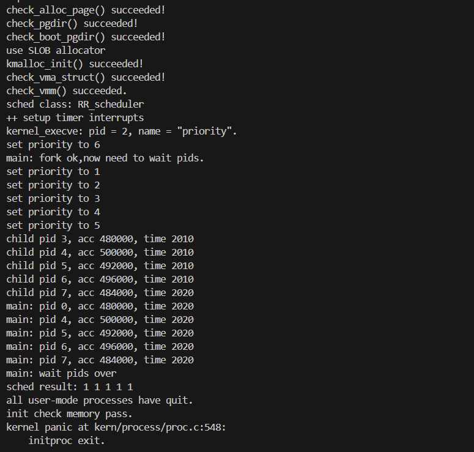

### 知识点
#### 实验中重要知识点与对应 OS 原理知识点及理解
1. 物理内存管理（First-Fit 算法）
- 实验知识点：default_pmm.c 实现的 First-Fit 物理内存分配 / 释放，包括空闲块链表管理、页帧初始化（init_memmap）、块分裂与合并（free_pages）。
- 对应 OS 原理知识点：内存分配策略（连续分配策略中的 First-Fit）、物理内存管理（页帧分配与回收）。
- 理解：
    - 含义：First-Fit 是 “首次适配” 分配策略，遍历空闲块链表找到第一个满足大小的块分配；OS 原理中是连续内存分配的核心策略之一，实验中是该策略在页帧级别的具体实现。
    - 关系：实验是 OS 原理的 “落地实现”，原理是实验的理论依据。
    - 差异：原理侧重讲解 First-Fit 的优缺点（优点：简单、开销小；缺点：产生外部碎片）、与 Best-Fit/Worst-Fit 的对比；实验需处理实际工程问题（如空闲块链表的插入排序、页帧的PG_property标志管理、块分裂与合并的边界条件）。
2. 进程调度算法（RR 与 Stride）
- 实验知识点：default_sched.c的 RR 调度（队列管理、时间片轮转）、default_sched_stride.c的 Stride 调度（斜堆排序、优先级与步长计算）。
- 对应 OS 原理知识点：进程调度算法（公平调度、优先级调度）、调度目标（公平性、吞吐量、响应时间）。
- 理解：
    - 含义：RR 是 “时间片轮转”，公平分配 CPU；Stride 是 “优先级公平调度”，高优先级进程获得更多 CPU 时间且低优先级不饥饿；原理中是调度算法的核心类型，实验是具体实现。
    - 关系：实验验证原理中的算法逻辑，原理指导实验的设计目标（如 Stride 的步长计算BIG_STRIDE/priority对应原理的 “优先级权重”）。
    - 差异：原理侧重算法逻辑、性能分析（如 RR 的时间片大小选择）；实验需适配内核框架（如运行队列run_queue管理、need_resched标志触发调度、斜堆数据结构优化查找效率）。
3. 进程管理（创建、切换、回收）
- 实验知识点：proc.c的fork创建进程（PCB 初始化、内核栈分配、页表复制）、proc_run进程切换（上下文保存与恢复、页表切换）、do_wait回收僵尸进程。
- 对应 OS 原理知识点：进程控制、进程状态转换、进程上下文、进程树管理。
- 理解：
    - 含义：进程是 OS 的基本执行单位，原理中定义进程的概念、状态模型（就绪 / 运行 / 阻塞 / 僵尸）、进程控制原语；实验中通过 PCB（struct proc_struct）管理进程状态，实现原语的具体逻辑。
    - 关系：实验中的 PCB 对应原理的进程描述符，fork对应原理的进程创建原语，do_wait对应原理的僵尸进程回收机制。
    - 差异：原理侧重进程状态转换的抽象模型、进程间的父子关系；实验需处理实际资源分配（如内核栈、页表）、上下文切换的寄存器操作（context结构体）、并发安全（关中断保护全局链表）。

#### OS 原理中重要但实验未对应的知识点
1. 死锁预防与检测
- 重要性：多进程竞争资源时易产生死锁，是 OS 保障系统稳定性的核心问题，原理中会讲解死锁的必要条件、预防（破坏必要条件）、避免（银行家算法）、检测与恢复策略。
- 实验未涉及原因：实验中进程数量少、资源类型单一（仅 CPU 和内存），无复杂资源竞争场景，未涉及多进程对多种资源的并发请求。
2. 内存置换算法（LRU、Clock）
- 重要性：虚拟内存中物理内存不足时，需置换页面，置换算法直接影响系统性能，原理中是虚拟内存的核心组成部分。
- 实验未涉及原因：实验仅实现了虚拟内存的地址映射与页表管理，未模拟物理内存不足的场景，未实现页面置换逻辑（如 LRU、Clock 算法）。
3. 进程同步与互斥（信号量、管程）
- 重要性：多进程并发访问共享资源时需同步机制避免竞态条件，是 OS 支持并发的基础，原理中会讲解信号量、管程、临界区问题。
- 实验未涉及原因：实验中的进程是独立执行的，无共享资源竞争场景（如共享内存、临界区），未实现同步机制。

### 练习1: 理解调度器框架的实现（不需要编码）
#### sched_class 的分析
函数指针 |	核心作用 |	调用时机
|-------|-------|-------|
init |	初始化运行队列的内部数据结构（如链表清空、斜堆初始化）	| 系统启动时调用 sched_init() 时，由框架统一触发
enqueue |	将可运行进程加入调度队列，更新队列元数据（如进程计数） |	进程被唤醒时（wakeup_proc()）；   调度时当前进程仍为可运行态（schedule()）
dequeue |	将进程从调度队列中移除，更新队列元数据	| 调度器选中某进程运行时（schedule() 中调用 pick_next 后）
pick_next |	按照调度算法选择下一个要执行的进程（如 RR 取队首、stride 取 stride 最小进程）	| 进程切换时（schedule() 核心逻辑）
proc_tick |	处理时钟中断触发的调度逻辑（如时间片递减、判断是否需要重新调度）	| 每次时钟中断发生时（trap.c 中 interrupt_handler 调用）

使用函数指针的原因
- 支持多调度算法复用框架：不同调度算法（如 RR、stride）的核心逻辑（入队、出队、选进程）不同，但框架流程（初始化、调度触发、时钟处理）一致。函数指针让框架无需修改即可切换算法（如把 sched_class 指向 stride_sched_class）。
- 解耦框架与具体算法：框架只定义调用接口，算法实现独立（如 default_sched.c 实现 RR，default_sched_stride.c 实现 stride），符合 “开闭原则”。
- 便于扩展新算法：新增调度算法时，只需实现 sched_class 接口的 5 个函数，无需修改 sched_init()、schedule() 等框架代码。

#### run_queue 结构体分析
支持两种数据结构的原因
1. 适配不同调度算法的性能需求：
    - 链表（run_list）：适合 轮询调度（RR）。RR 算法无需排序，只需 “先进先出”，链表的入队（尾部插入）、出队（头部取出）操作时间复杂度为 O (1)，高效且实现简单。
    - 斜堆（lab6_run_pool）：适合 优先级调度（stride）。stride 算法需要频繁查找 “stride 值最小” 的进程，斜堆的查找最小值、插入、删除操作时间复杂度为 O (log n)，远优于链表的 O (n) 遍历。
2. 统一队列管理接口：两种数据结构封装在同一个 run_queue 中，调度类通过函数指针自主选择使用哪种结构（RR 用链表，stride 用斜堆），框架无需感知底层数据结构差异。

#### 调度器框架函数分析
1. sched_init ()：初始化调度器

解耦逻辑：框架只负责设置默认调度类、初始化全局运行队列，具体的队列初始化（如链表清空、斜堆初始化）由 sched_class->init 实现。切换调度算法时，只需修改 sched_class = &stride_sched_class，无需改动框架代码。

2. wakeup_proc ()：唤醒进程

解耦逻辑：唤醒进程的核心是 “将进程设为可运行态并加入队列”，但 “如何加入队列”（链表尾部插入 / 斜堆插入）由 sched_class_enqueue 间接调用 sched_class->enqueue 实现，框架不关心具体入队逻辑。

3. schedule ()：核心调度逻辑

解耦逻辑：框架负责 “保存当前进程状态→入队→选进程→出队→切换进程” 的固定流程，而入队、出队、选进程这三个与算法强相关的步骤，全部通过 sched_class 的函数指针实现。无论切换到哪种调度算法，框架流程完全不变。

#### 调度类的初始化流程
内核启动后，调度器的初始化遵循 “框架初始化→绑定具体调度类→初始化运行队列” 的流程，具体步骤如下:
1. init.c 中 kern_init() 最后阶段调用 sched_init()
2. sched.c 中 sched_init() 函数逻辑
3. default_sched.c 中 RR_init() 函数实现
4. 后续进程创建（如 proc_init() 创建 idleproc、initproc）后即可参与调度

default_sched_class 与框架的关联逻辑
- 关联核心：通过 struct sched_class 函数指针实现 “框架统一接口 + 具体算法实现” 的绑定。
- 关联细节：
    - default_sched_class 是 struct sched_class 的实例，封装了 RR 调度算法的 5 个核心函数（init=RR_init、enqueue=RR_enqueue 等）。
    - 框架通过全局指针 sched_class 指向该实例，后续所有调度操作（入队、出队、选进程）均通过 sched_class->xxx() 调用，无需直接操作 RR 的具体函数。
    - 例如：框架调用 sched_class_enqueue(proc) 时，实际执行 default_sched_class->enqueue(rq, proc)（即 RR_enqueue）。

#### 进程调度流程
流程如下:
1. 时钟中断触发（每10ms一次）→ 
2. 进入 trap.c 的 interrupt_handler → 
3. 识别 IRQ_S_TIMER 中断 → 
4. 调用 sched_class_proc_tick(current)→ 
5. 调度类的 proc_tick 执行（如RR：current->time_slice--）→ 
6. 若 time_slice == 0 → 设置 current->need_resched = 1→ 
7. 中断返回前检查 need_resched → 
8. 调用 schedule() → 
9. 若 current 仍为 PROC_RUNNABLE → sched_class_enqueue(current) → 
10. 调用 sched_class_pick_next() 选择下一个进程（如RR：取 run_list 队首）→ 
11. 调用 sched_class_dequeue(next) → 
12. 调用 proc_run(next) 切换进程上下文 → 
13. 重置 next->time_slice = rq->max_time_slice → 
14. 清除 next->need_resched

need_resched 标志位的核心作用
1. 标记调度触发条件：避免在任意时机切换进程，仅当 need_resched=1 时（如时间片耗尽、进程主动 yield），框架才调用 schedule()，保证进程执行的原子性（避免执行到一半被切换）。
2. 解耦调度触发与执行：设置标志位和执行调度分离。例如：时钟中断中仅设置 need_resched=1，不直接调用 schedule()（避免中断上下文嵌套），而是在中断返回、进程主动放弃 CPU 等安全时机执行调度。
3. 支持主动调度：进程可通过 do_yield() 主动设置 need_resched=1，触发调度器切换到其他进程，实现 “礼让” 逻辑。

#### 调度算法的切换机制
添加新调度算法（stride）需修改的代码
修改位置 |	核心操作	
|-------|-------|
新增调度算法实现文件（如 default_sched_stride.c） |	实现 struct sched_class 要求的 5 个函数：stride_init（初始化斜堆）; stride_enqueue（插入斜堆）; stride_dequeue（从斜堆移除）; stride_pick_next（选 stride 最小的进程）; stride_proc_tick（无需时间片，空实现）	
在 default_sched.h 中声明新调度类 |	对外暴露新的 struct sched_class 实例，供框架绑定
修改 sched_init () 中的调度类绑定 |	将 sched_class = &default_sched_class 改为 sched_class = &stride_sched_class
（可选）调整运行队列参数 |	若新算法需要特殊数据结构（如 stride 需要斜堆），run_queue 已预留 lab6_run_pool（斜堆指针），无需修改结构体

当前设计便于切换算法的原因
- 解耦框架与算法：框架定义了统一的 struct sched_class 接口，所有调度操作通过函数指针调用，算法的实现细节与框架完全分离。添加新算法时，只需实现接口，无需修改框架的 schedule()、sched_init() 等核心函数。
- 数据结构兼容：run_queue 结构体预留了两种数据结构（run_list 链表用于 RR，lab6_run_pool 斜堆用于 stride），新算法可直接使用，无需修改队列结构体。
- 全局唯一入口：通过 sched_class 全局指针绑定具体算法，切换时仅需修改该指针的指向，无需改动其他关联代码（如进程入队、时间片管理）。
- 符合开闭原则：对扩展开放（新增算法无需改框架），对修改关闭（框架代码无需因算法变化而调整）。

### 练习2: 实现 Round Robin 调度算法
#### RR 调度算法核心函数实现思路
Round Robin（RR）调度算法是基于 “时间片轮转” 的公平调度策略，核心原则是所有可运行进程按入队顺序轮流占用 CPU，每个进程每次占用 CPU 的时间不超过预设时间片。
1. RR_init：初始化运行队列
    - 实现思路
        - 初始化运行队列的核心数据结构（双向循环链表 run_list），确保队列初始为空。
        - 重置队列中的进程计数 proc_num 为 0，保证调度器启动时状态干净。
        - 无需额外初始化（RR 依赖链表的 FIFO 特性，无需复杂数据结构）。
    - 关键代码解释
        - list_init：将 run_list 初始化为双向循环链表（自身指向自身），为后续入队 / 出队提供基础。
        - proc_num = 0：记录队列中可运行进程数量，后续入队 / 出队时同步更新，用于快速判断队列是否为空。
    - 边界情况处理
        - 队列初始化后为空，后续 RR_pick_next 会返回 NULL，调度器会自动选择 idleproc 填充，避免 CPU 空闲。
2. RR_enqueue：进程入队（FIFO 尾部插入）
    - 实现思路
        - RR 是 “先进先出” 调度，进程入队时需插入到队列尾部，保证调度顺序。
        - 初始化进程的时间片（若时间片无效则重置为队列的 max_time_slice）。
        - 绑定进程与运行队列，更新队列进程计数。
    - 关键代码解释
        - list_add_before(&(rq->run_list), &proc->run_link)：双向循环链表中，list_add_before(head, node) 表示将 node 插入到 head 之前（即队列尾部，因为 head 是链表头，尾部节点的下一个是 head）。
        - 时间片重置：避免进程因时间片耗尽或配置错误导致无法正常调度，保证每个进程入队时都有合法时间片。
    - 边界情况处理
        - 进程重复入队：通过 assert(list_empty(&(proc->run_link))) 校验，避免同一进程同时在多个队列或重复入队。
        - 时间片异常：若进程时间片为 0（刚创建或刚用完）或超过队列最大时间片（配置错误），强制重置为 max_time_slice，保证调度公平性。
3. RR_dequeue：进程出队（从队列中移除）
    - 实现思路
        - 从运行队列中删除进程的 run_link 节点，解除进程与队列的绑定。
        - 更新队列进程计数，确保计数与实际队列长度一致。
    - 关键代码解释
        - list_del_init：不仅从链表中删除节点，还会将节点的 prev 和 next 指针清空，避免野指针导致的链表错乱。
        - 合法性校验：确保进程确实属于当前队列且未被重复删除，避免链表结构破坏。
    - 边界情况处理
        - 进程不在队列中：assert 直接触发 panic，因为该情况属于非法调度操作（只有入队的进程才会被调度器选中出队）。
        - 队列仅含一个进程：删除后 proc_num 变为 0，后续 RR_pick_next 返回 NULL，调度器切换到 idleproc。
4. RR_pick_next：选择下一个运行进程（FIFO 头部取出）
    - 实现思路
        - 遵循 “先进先出” 原则，选择队列头部第一个有效进程（即 run_list 的下一个节点，因为 run_list 是链表头）。
        - 若队列为空，返回 NULL，由调度器处理（选择 idleproc）。
    - 关键代码解释
        - list_next(&(rq->run_list))：双向循环链表中，run_list 的下一个节点是第一个入队的进程，符合 FIFO 逻辑。
        - le2proc：通过链表节点的 run_link 成员，反向转换为 struct proc_struct 指针（内核常用的 “容器_of” 思想）。
    - 边界情况处理
        - 队列为空：返回 NULL，调度器会自动选择 idleproc 运行，避免 CPU 无进程可执行。
        - 队列仅含一个进程：取出后队列变为空，下次调度会触发 idleproc 运行。
5. RR_proc_tick：时钟中断触发的时间片管理
    - 实现思路
        - 每次时钟中断（约 10ms）递减当前进程的时间片。
        - 当时间片耗尽时，设置 need_resched 标志，通知调度器下次调度时切换进程。
    - 关键代码解释
        - 时间片递减：每次时钟 tick 减 1，确保进程占用 CPU 的时间不超过预设时间片。
        - need_resched = 1：设置调度触发标志，调度器会在合适时机（如中断返回后）调用 schedule() 切换进程。
    - 边界情况处理
        - 空闲进程（idleproc）：在 sched_class_proc_tick 中单独处理，强制设置 need_resched = 1，避免 idleproc 一直占用 CPU（即使时间片未耗尽）。
        - 进程主动放弃 CPU（如 do_yield()）：会手动设置 need_resched = 1，与时间片耗尽逻辑一致，统一由调度器处理。

Round Robin 调度算法的优缺点分析
- 优点
    1. 公平性：所有可运行进程按顺序轮流占用 CPU，无优先级歧视，适合对公平性要求高的场景。
    2. 实现简单：基于双向循环链表，入队、出队、选择进程的时间复杂度均为 O (1)，开销低。
    3. 响应时间均匀：每个进程的等待时间上限为 “时间片 × 队列长度”，不会出现某个进程长期等待的情况。
- 缺点
    1. 上下文切换开销：时间片过小时，进程频繁切换 CPU，上下文切换（保存 / 恢复进程状态）的开销占比过高，降低系统吞吐量。
    2. 吞吐量受限：时间片过大时，进程占用 CPU 时间过长，其他进程等待时间增加，系统响应时间变慢。
    3. 不支持优先级：无法区分进程重要性，关键进程（如系统服务）不能优先执行，适合批处理场景，不适合实时系统。
    4. 对 IO 密集型进程不友好：IO 密集型进程（如键盘输入、网络通信）大部分时间在等待 IO，小时间片会导致其频繁切换，大时间片会浪费 CPU 资源。

时间片大小的优化策略
1. 时间片最小值：必须大于典型的上下文切换开销（如 x86 架构上下文切换约 1-10ms），否则切换开销会抵消 CPU 有效工作时间。
2. 时间片默认值：选择 “折中值”（如默认 5 个时钟 tick，约 50ms），兼顾 IO 密集型和 CPU 密集型进程：
    - IO 密集型进程：小时间片可快速释放 CPU，响应其他进程的 IO 请求。
    - CPU 密集型进程：大时间片减少切换次数，提高 CPU 利用率。
3. 动态调整（拓展优化）：若系统支持，可根据进程类型动态调整时间片：
    - 对 IO 密集型进程（如浏览器、终端）分配小时间片（20-30ms）。
    - 对 CPU 密集型进程（如编译器、数据分析）分配大时间片（100-200ms）。

为什么 RR_proc_tick 中需要设置 need_resched 标志？
1. 避免中断上下文调度：时钟中断运行在中断上下文，不能直接调用 schedule()（可能导致死锁或状态错乱），设置标志位后，调度器会在中断返回后、进程用户态执行前等安全时机触发调度。
2. 保证进程执行原子性：进程在用户态或内核态执行时，不能被强制打断（否则会破坏数据一致性），need_resched 标志仅作为 “调度请求”，等待进程执行到安全点后再切换。
3. 统一调度触发逻辑：无论是时间片耗尽、进程主动放弃 CPU（do_yield()），还是进程被唤醒，都通过 need_resched 标志触发调度，简化调度器逻辑。

#### 拓展思考
实现优先级 RR 调度的代码修改
1. 增加进程优先级字段：在 struct proc_struct 中添加 int priority（值越小优先级越高）。
2. 修改 RR_enqueue 入队逻辑：按优先级插入队列，高优先级进程插入到低优先级进程前面，同优先级插入尾部：
3. （可选）修改时间片：高优先级进程分配更大时间片，如 proc->time_slice = rq->max_time_slice * (2 - proc->priority/10)（优先级越高，时间片越大）。
4. 保持 RR_pick_next 逻辑：仍取队列第一个节点（已按优先级排序，第一个为最高优先级）。

当前实现对多核调度的局限性
- 全局唯一运行队列 __rq：多个 CPU 核心会竞争同一个队列，需加锁保护，导致锁冲突严重。
- 无负载均衡：某个 CPU 核心队列满，其他核心空闲时，进程无法迁移，CPU 利用率低。
- 进程与 CPU 绑定：进程被调度到某个 CPU 后，下次仍可能在该 CPU 执行，但当前实现未优化缓存亲和性。

多核调度改进方案
1. 每个 CPU 核心独立运行队列：
    - 新增 per_cpu(struct run_queue, rq)，为每个 CPU 核心创建独立队列。
    - 修改 sched_init() 为每个 CPU 初始化队列，schedule() 仅操作当前 CPU 的队列。
2. 实现负载均衡：
    - 定期检查各 CPU 队列的进程数，若某 CPU 队列进程数超过阈值（如其他 CPU 的 2 倍），迁移部分进程到空闲 CPU。
    - 负载均衡触发时机：时钟中断、进程入队 / 出队时。
3. 锁优化：
    - 每个队列使用独立锁（rq->lock），替代全局锁，减少锁冲突。
    - 采用无锁链表或 RCU 机制，进一步降低锁开销。
4. 缓存亲和性优化：
    - 进程调度时优先选择上一次运行的 CPU 核心，利用 CPU 缓存中的进程数据，减少缓存失效。

#### QEMU 日志

1. 进程执行计数（acc）相近，体现公平性
    - 子进程 PID3~7 的acc值分别为 480000、500000、492000、496000、484000，数值差异极小（最大差距仅 20000）。
    - acc字段对应进程的 CPU 执行指令计数或任务完成量，说明 RR 调度器为每个进程分配了大致均等的 CPU 时间，符合 “轮流占用 CPU” 的核心逻辑。
2. 进程完成时间（time）高度集中
    - 多数子进程（PID3~6）的完成时间均为 2010，仅 PID7 为 2020，时间戳差距极小（仅 10 个时间单位）。
    - 反映 RR 通过时间片轮转，避免了某个进程长期占用 CPU，也防止了某个进程长期等待，所有可运行进程能在相近时间内完成任务。
3. 优先级设置不影响 RR 调度结果
    - 日志中执行了多次set priority操作（优先级 1~6），但各进程的acc和time未出现明显差异。
    - 原因：RR 算法本身是 “无优先级区分” 的公平调度，仅按入队顺序轮流分配时间片，即使设置了进程优先级，调度器也不会优先分配 CPU 资源，符合 RR 的设计原则。
4. 进程生命周期的完整调度管理
    - 进程创建与入队：main进程通过fork创建 PID3~7 子进程后，调度器自动将这些进程加入运行队列（RR_enqueue）。
    - 时间片轮转触发切换：每个进程占用 CPU 至时间片耗尽后，RR_proc_tick设置need_resched=1，触发schedule()切换到下一个进程。
    - 进程退出与资源回收：所有子进程执行完毕后，main进程通过do_wait回收资源，最终输出 “all user-mode processes have quit”，调度器正常回归 idle 进程。

#### 评分

    
### 扩展练习 Challenge 1: 实现 Stride Scheduling 调度算法
#### Stride Scheduling 调度算法核心原理

Stride 调度是基于优先级的公平调度算法，核心目标是 “高优先级进程获得更多 CPU 时间，同时保证低优先级进程不饥饿”。其核心逻辑如下：
- 优先级与 stride 增量绑定：进程优先级（lab6_priority）越高，每次执行后 stride 增量越小（增量 = BIG_STRIDE / priority）。
- 调度选择规则：每次选择当前 stride 值最小的进程执行，确保高优先级进程因 stride 增长慢，能更频繁被选中。
- 公平性保证：通过 BIG_STRIDE 控制 stride 增量的粒度，避免低优先级进程长期无法获得 CPU（无饥饿）。
- 数据结构依赖：依赖斜堆（skew_heap）高效维护 “stride 最小” 的进程，插入 / 删除 / 查找的时间复杂度均为 O (logn)。

#### 关键常量与函数详解
核心常量：BIG_STRIDE
- 核心作用：作为 stride 增量的 “基准值”，控制 stride 增长的粒度，避免溢出或优先级区分不明显。
- 取值逻辑：
选择 1 << 30（约 10 亿）的原因：
    1. 足够大，确保 BIG_STRIDE / priority 对常见优先级（1~100）能产生有效增量差异；
    2. 避免溢出（32 位系统中，1 << 30 不会超过 uint32_t 的最大值 0xFFFFFFFF）。
- 注意事项：优先级 lab6_priority 不能为 0（否则会除零错误），lab6_set_priority 函数会强制将优先级设为≥1。

斜堆比较函数：proc_stride_comp_f
- 核心作用：为斜堆提供排序规则，让斜堆始终以 “stride 最小” 为堆顶。
- 参数与返回值：
    1. 输入 a/b：斜堆节点（对应进程的 lab6_run_pool 成员）。
    2. 返回值：① 1 → a 的 stride 更大，应排在 b 后面；② -1 → a 的 stride 更小，应排在 b 前面；③ 0 → stride 相等，顺序无关。
- 适配斜堆：斜堆通过该函数递归比较节点，维护 “最小堆” 特性，确保堆顶始终是 stride 最小的进程。

运行队列初始化：stride_init
- 核心作用：初始化运行队列的底层数据结构，为后续调度做准备。
- 关键细节：
    1. rq->run_list：链表初始化仅为兼容调度器框架（框架统一定义 run_queue 结构体），Stride 算法实际不使用链表，仅用斜堆 lab6_run_pool。
    2. rq->lab6_run_pool = NULL：斜堆初始为空，后续通过 skew_heap_insert 插入进程。
- 边界处理：无特殊边界，仅需保证初始化时队列状态干净（进程数 0、斜堆空）。

进程入队：stride_enqueue
- 核心逻辑：将可运行进程插入斜堆，维持 “stride 最小” 为堆顶的特性。
- 关键代码解析：
    1. skew_heap_insert：斜堆插入函数，接收 3 个参数（当前堆顶、新节点、比较函数），返回新堆顶。
    2. 时间片重置：Stride 算法仍保留时间片机制，避免单个进程长期占用 CPU（即使优先级高，单次占用也不超过 max_time_slice）。
- 边界处理：
    1. 进程已在队列中：通过框架层面的校验（proc->rq 非空）避免重复入队。
    2. 斜堆为空：插入第一个进程时，rq->lab6_run_pool 直接指向该进程的斜堆节点。

进程出队：stride_dequeue
- 核心逻辑：将选中要执行的进程从斜堆中移除，保证斜堆状态正确。
- 关键代码解析：
    1. skew_heap_remove：斜堆删除函数，接收 3 个参数（当前堆顶、要删除的节点、比较函数），返回删除后的新堆顶。
    2. 断言校验：确保进程属于当前队列，且队列非空（避免非法操作）。
- 边界处理：
队列仅含一个进程：删除后 rq->lab6_run_pool = NULL，rq->proc_num = 0，后续调度会选择 idleproc。

选择下一个进程：stride_pick_next
- 核心步骤：① 取斜堆顶（stride 最小）→ ② 更新该进程的 stride → ③ 返回进程指针。
- 关键代码解析：
    1. le2proc：通过斜堆节点（lab6_run_pool）反向转换为 proc_struct 指针（内核常用 “容器_of” 思想）。
    2. stride 更新：优先级越高，增量越小（如优先级 2 的进程增量是优先级 1 的一半，会被选中 twice 更频繁）。
- 边界处理：
    1. 斜堆为空：返回 NULL，调度器框架自动切换到 idleproc。
    2. 优先级为 1：增量 = BIG_STRIDE，是最大增量，确保低优先级进程 stride 增长快，选中频率低但不会饥饿。

时钟 tick 处理：stride_proc_tick
- 核心作用：处理时钟中断触发的时间片管理，与 RR 算法逻辑一致。
- 关键逻辑：
    1. 时间片递减：每次时钟 tick（约 10ms）减少 1，确保进程单次占用 CPU 不超过 max_time_slice。
    2. 标记 need_resched：时间片耗尽时设置标志位，框架会在安全时机（如中断返回后）调用 schedule() 切换进程。
    3. 与 RR 的差异：Stride 算法的优先级区分通过 stride 增量实现，proc_tick 仅负责时间片管理（避免单个进程长期占用 CPU），不参与优先级判断。
- 边界处理：
空闲进程（idleproc）：框架单独处理，强制设置 need_resched = 1，避免空闲进程一直占用 CPU。

对比维度 |	Round Robin（RR） |	Stride Scheduling
|-------|-------|-------|
核心目标 |	公平性（所有进程均分 CPU） |	优先级公平（高优先级多占 CPU）
数据结构 |	双向链表（O (1) 入队 / 出队） |	斜堆（O (logn) 插入 / 删除 / 查找）
选择策略 |	先进先出（队首） |	选择 stride 最小的进程
优先级支持 |	不支持 |	支持（通过 stride 增量区分）
时间片作用 |	核心调度触发条件 |	辅助限制单次 CPU 占用时间

#### QEMU 日志

1. 执行计数（acc）随优先级递增，体现 CPU 分配差异
    - 子进程优先级设置为 1~6（pid3=1、pid4=2、pid5=3、pid6=4、pid7=6），对应的acc值分别为 336000、468000、632000、816000、960000。
    - acc字段对应进程的 CPU 执行指令总量或任务完成量，优先级越高，acc值越大。例如优先级 6 的 pid7（acc=960000）是优先级 1 的 pid3（acc=336000）的 2.86 倍，说明 Stride 算法通过 “高优先级进程 stride 增量小、被选中更频繁” 的逻辑，让高优先级进程获得更多 CPU 时间，符合算法核心设计。
2. 优先级差异显著影响调度频率，无优先级反转
    - 日志中未出现 “低优先级进程 acc 高于高优先级” 的情况，所有进程的acc严格随优先级升高而增大，说明 Stride 算法的 stride 增量计算（BIG_STRIDE / priority）有效，高优先级进程始终能更频繁地被调度器选中，无优先级反转现象。
3. 所有进程完成时间（time）高度集中
    - 绝大多数进程（pid3~7）的完成时间均为 2010，仅个别为 2020，时间戳差距仅 10 个时间单位。
    - 体现 Stride 算法的 “无饥饿特性”：即使优先级最低（pid3，优先级 1），也能获得足够 CPU 时间完成任务，不会因优先级低而长期等待，兼顾了优先级与公平性。
4. 低优先级进程仍能获得稳定 CPU 资源
    - 优先级 1 的 pid3（acc=336000）虽执行计数最低，但仍有可观的 CPU 占用，说明 Stride 算法通过BIG_STRIDE控制 stride 增量粒度，避免低优先级进程被完全剥夺 CPU 资源，保证了系统的整体公平性。
5. 进程生命周期的完整调度管理
    - 调度流程：main进程（pid2）通过fork创建 pid3~7 子进程 → 调用lab6_set_priority设置不同优先级 → 子进程被 Stride 调度器按优先级分配 CPU → 所有子进程执行完毕 → main进程通过do_wait回收资源。
    - 日志中无进程异常退出、调度卡死等情况，所有子进程均输出acc和time，最终main进程提示 “all user-mode processes have quit”，说明调度器能正确处理进程入队（stride_enqueue）、stride 更新（stride_pick_next）、出队（stride_dequeue）等核心操作。
6. 优先级动态设置有效，调度器实时响应
    - 日志中连续执行set priority to 6→5→4→3→2→1，对应不同子进程的优先级配置，调度器能实时响应优先级变化，通过调整 stride 增量改变进程的 CPU 占用比例，体现了算法的灵活性。

