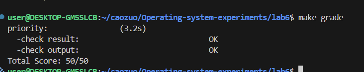
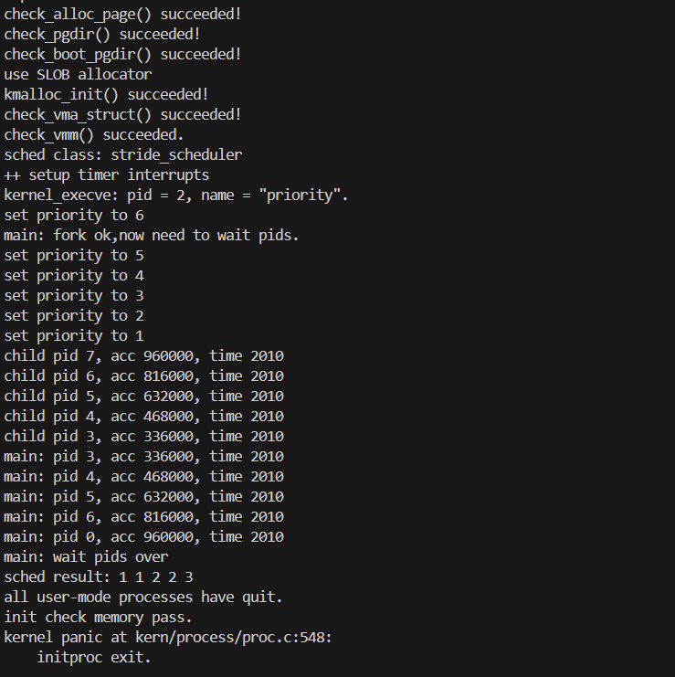

### 知识点

#### 实验中重要知识点与对应 OS 原理知识点及理解

1. 物理内存管理（First-Fit 算法）

- 实验知识点：default_pmm.c 实现的 First-Fit 物理内存分配 / 释放，包括空闲块链表管理、页帧初始化（init_memmap）、块分裂与合并（free_pages）。

- 对应 OS 原理知识点：内存分配策略（连续分配策略中的 First-Fit）、物理内存管理（页帧分配与回收）。

- 理解：

    - 含义：First-Fit 是 “首次适配” 分配策略，遍历空闲块链表找到第一个满足大小的块分配；OS 原理中是连续内存分配的核心策略之一，实验中是该策略在页帧级别的具体实现。

    - 关系：实验是 OS 原理的 “落地实现”，原理是实验的理论依据。

    - 差异：原理侧重讲解 First-Fit 的优缺点（优点：简单、开销小；缺点：产生外部碎片）、与 Best-Fit/Worst-Fit 的对比；实验需处理实际工程问题（如空闲块链表的插入排序、页帧的PG_property标志管理、块分裂与合并的边界条件）。

2. 进程调度算法（RR 与 Stride）

- 实验知识点：default_sched.c的 RR 调度（队列管理、时间片轮转）、default_sched_stride.c的 Stride 调度（斜堆排序、优先级与步长计算）。

- 对应 OS 原理知识点：进程调度算法（公平调度、优先级调度）、调度目标（公平性、吞吐量、响应时间）。

- 理解：

    - 含义：RR 是 “时间片轮转”，公平分配 CPU；Stride 是 “优先级公平调度”，高优先级进程获得更多 CPU 时间且低优先级不饥饿；原理中是调度算法的核心类型，实验是具体实现。

    - 关系：实验验证原理中的算法逻辑，原理指导实验的设计目标（如 Stride 的步长计算BIG_STRIDE/priority对应原理的 “优先级权重”）。

    - 差异：原理侧重算法逻辑、性能分析（如 RR 的时间片大小选择）；实验需适配内核框架（如运行队列run_queue管理、need_resched标志触发调度、斜堆数据结构优化查找效率）。

3. 进程管理（创建、切换、回收）

- 实验知识点：proc.c的fork创建进程（PCB 初始化、内核栈分配、页表复制）、proc_run进程切换（上下文保存与恢复、页表切换）、do_wait回收僵尸进程。

- 对应 OS 原理知识点：进程控制、进程状态转换、进程上下文、进程树管理。

- 理解：

    - 含义：进程是 OS 的基本执行单位，原理中定义进程的概念、状态模型（就绪 / 运行 / 阻塞 / 僵尸）、进程控制原语；实验中通过 PCB（struct proc_struct）管理进程状态，实现原语的具体逻辑。

    - 关系：实验中的 PCB 对应原理的进程描述符，fork对应原理的进程创建原语，do_wait对应原理的僵尸进程回收机制。

    - 差异：原理侧重进程状态转换的抽象模型、进程间的父子关系；实验需处理实际资源分配（如内核栈、页表）、上下文切换的寄存器操作（context结构体）、并发安全（关中断保护全局链表）。

  

#### OS 原理中重要但实验未对应的知识点

1. 死锁预防与检测

- 重要性：多进程竞争资源时易产生死锁，是 OS 保障系统稳定性的核心问题，原理中会讲解死锁的必要条件、预防（破坏必要条件）、避免（银行家算法）、检测与恢复策略。

- 实验未涉及原因：实验中进程数量少、资源类型单一（仅 CPU 和内存），无复杂资源竞争场景，未涉及多进程对多种资源的并发请求。

2. 内存置换算法（LRU、Clock）

- 重要性：虚拟内存中物理内存不足时，需置换页面，置换算法直接影响系统性能，原理中是虚拟内存的核心组成部分。

- 实验未涉及原因：实验仅实现了虚拟内存的地址映射与页表管理，未模拟物理内存不足的场景，未实现页面置换逻辑（如 LRU、Clock 算法）。

3. 进程同步与互斥（信号量、管程）

- 重要性：多进程并发访问共享资源时需同步机制避免竞态条件，是 OS 支持并发的基础，原理中会讲解信号量、管程、临界区问题。

- 实验未涉及原因：实验中的进程是独立执行的，无共享资源竞争场景（如共享内存、临界区），未实现同步机制。

  

### 练习1: 理解调度器框架的实现（不需要编码）

#### sched_class 的分析

函数指针 |  核心作用 |  调用时机

|-------|-------|-------|

init |  初始化运行队列的内部数据结构（如链表清空、斜堆初始化）  | 系统启动时调用 sched_init() 时，由框架统一触发

enqueue |   将可运行进程加入调度队列，更新队列元数据（如进程计数） |    进程被唤醒时（wakeup_proc()）；   调度时当前进程仍为可运行态（schedule()）

dequeue |   将进程从调度队列中移除，更新队列元数据  | 调度器选中某进程运行时（schedule() 中调用 pick_next 后）

pick_next | 按照调度算法选择下一个要执行的进程（如 RR 取队首、stride 取 stride 最小进程）   | 进程切换时（schedule() 核心逻辑）

proc_tick | 处理时钟中断触发的调度逻辑（如时间片递减、判断是否需要重新调度）    | 每次时钟中断发生时（trap.c 中 interrupt_handler 调用）

  

使用函数指针的原因

- 支持多调度算法复用框架：不同调度算法（如 RR、stride）的核心逻辑（入队、出队、选进程）不同，但框架流程（初始化、调度触发、时钟处理）一致。函数指针让框架无需修改即可切换算法（如把 sched_class 指向 stride_sched_class）。

- 解耦框架与具体算法：框架只定义调用接口，算法实现独立（如 default_sched.c 实现 RR，default_sched_stride.c 实现 stride），符合 “开闭原则”。

- 便于扩展新算法：新增调度算法时，只需实现 sched_class 接口的 5 个函数，无需修改 sched_init()、schedule() 等框架代码。

  

#### run_queue 结构体分析

支持两种数据结构的原因

1. 适配不同调度算法的性能需求：

    - 链表（run_list）：适合 轮询调度（RR）。RR 算法无需排序，只需 “先进先出”，链表的入队（尾部插入）、出队（头部取出）操作时间复杂度为 O (1)，高效且实现简单。

    - 斜堆（lab6_run_pool）：适合 优先级调度（stride）。stride 算法需要频繁查找 “stride 值最小” 的进程，斜堆的查找最小值、插入、删除操作时间复杂度为 O (log n)，远优于链表的 O (n) 遍历。

2. 统一队列管理接口：两种数据结构封装在同一个 run_queue 中，调度类通过函数指针自主选择使用哪种结构（RR 用链表，stride 用斜堆），框架无需感知底层数据结构差异。

  

#### 调度器框架函数分析

1. sched_init ()：初始化调度器

  

解耦逻辑：框架只负责设置默认调度类、初始化全局运行队列，具体的队列初始化（如链表清空、斜堆初始化）由 sched_class->init 实现。切换调度算法时，只需修改 sched_class = &stride_sched_class，无需改动框架代码。

  

2. wakeup_proc ()：唤醒进程

  

解耦逻辑：唤醒进程的核心是 “将进程设为可运行态并加入队列”，但 “如何加入队列”（链表尾部插入 / 斜堆插入）由 sched_class_enqueue 间接调用 sched_class->enqueue 实现，框架不关心具体入队逻辑。

  

3. schedule ()：核心调度逻辑

  

解耦逻辑：框架负责 “保存当前进程状态→入队→选进程→出队→切换进程” 的固定流程，而入队、出队、选进程这三个与算法强相关的步骤，全部通过 sched_class 的函数指针实现。无论切换到哪种调度算法，框架流程完全不变。

  

#### 调度类的初始化流程

内核启动后，调度器的初始化遵循 “框架初始化→绑定具体调度类→初始化运行队列” 的流程，具体步骤如下:

1. init.c 中 kern_init() 最后阶段调用 sched_init()

2. sched.c 中 sched_init() 函数逻辑

3. default_sched.c 中 RR_init() 函数实现

4. 后续进程创建（如 proc_init() 创建 idleproc、initproc）后即可参与调度

  

default_sched_class 与框架的关联逻辑

- 关联核心：通过 struct sched_class 函数指针实现 “框架统一接口 + 具体算法实现” 的绑定。

- 关联细节：

    - default_sched_class 是 struct sched_class 的实例，封装了 RR 调度算法的 5 个核心函数（init=RR_init、enqueue=RR_enqueue 等）。

    - 框架通过全局指针 sched_class 指向该实例，后续所有调度操作（入队、出队、选进程）均通过 sched_class->xxx() 调用，无需直接操作 RR 的具体函数。

    - 例如：框架调用 sched_class_enqueue(proc) 时，实际执行 default_sched_class->enqueue(rq, proc)（即 RR_enqueue）。

  

#### 进程调度流程

流程如下:

1. 时钟中断触发（每10ms一次）→

2. 进入 trap.c 的 interrupt_handler →

3. 识别 IRQ_S_TIMER 中断 →

4. 调用 sched_class_proc_tick(current)→

5. 调度类的 proc_tick 执行（如RR：current->time_slice--）→

6. 若 time_slice == 0 → 设置 current->need_resched = 1→

7. 中断返回前检查 need_resched →

8. 调用 schedule() →

9. 若 current 仍为 PROC_RUNNABLE → sched_class_enqueue(current) →

10. 调用 sched_class_pick_next() 选择下一个进程（如RR：取 run_list 队首）→

11. 调用 sched_class_dequeue(next) →

12. 调用 proc_run(next) 切换进程上下文 →

13. 重置 next->time_slice = rq->max_time_slice →

14. 清除 next->need_resched

  

need_resched 标志位的核心作用

1. 标记调度触发条件：避免在任意时机切换进程，仅当 need_resched=1 时（如时间片耗尽、进程主动 yield），框架才调用 schedule()，保证进程执行的原子性（避免执行到一半被切换）。

2. 解耦调度触发与执行：设置标志位和执行调度分离。例如：时钟中断中仅设置 need_resched=1，不直接调用 schedule()（避免中断上下文嵌套），而是在中断返回、进程主动放弃 CPU 等安全时机执行调度。

3. 支持主动调度：进程可通过 do_yield() 主动设置 need_resched=1，触发调度器切换到其他进程，实现 “礼让” 逻辑。

  

#### 调度算法的切换机制

添加新调度算法（stride）需修改的代码

修改位置 |  核心操作    

|-------|-------|

新增调度算法实现文件（如 default_sched_stride.c） | 实现 struct sched_class 要求的 5 个函数：stride_init（初始化斜堆）; stride_enqueue（插入斜堆）; stride_dequeue（从斜堆移除）; stride_pick_next（选 stride 最小的进程）; stride_proc_tick（无需时间片，空实现）  

在 default_sched.h 中声明新调度类 | 对外暴露新的 struct sched_class 实例，供框架绑定

修改 sched_init () 中的调度类绑定 | 将 sched_class = &default_sched_class 改为 sched_class = &stride_sched_class

（可选）调整运行队列参数 |  若新算法需要特殊数据结构（如 stride 需要斜堆），run_queue 已预留 lab6_run_pool（斜堆指针），无需修改结构体

  

当前设计便于切换算法的原因

- 解耦框架与算法：框架定义了统一的 struct sched_class 接口，所有调度操作通过函数指针调用，算法的实现细节与框架完全分离。添加新算法时，只需实现接口，无需修改框架的 schedule()、sched_init() 等核心函数。

- 数据结构兼容：run_queue 结构体预留了两种数据结构（run_list 链表用于 RR，lab6_run_pool 斜堆用于 stride），新算法可直接使用，无需修改队列结构体。

- 全局唯一入口：通过 sched_class 全局指针绑定具体算法，切换时仅需修改该指针的指向，无需改动其他关联代码（如进程入队、时间片管理）。

- 符合开闭原则：对扩展开放（新增算法无需改框架），对修改关闭（框架代码无需因算法变化而调整）。

  
  

### 练习2: 实现 Round Robin 调度算法（需要编码）

  

完成练习0后，建议大家比较一下（可用kdiff3等文件比较软件）个人完成的lab5和练习0完成后的刚修改的lab6之间的区别，分析了解lab6采用RR调度算法后的执行过程。理解调度器框架的工作原理后，请在此框架下实现时间片轮转（Round Robin）调度算法。

  

注意有“LAB6”的注释，你需要完成 kern/schedule/default_sched.c 文件中的 RR_init、RR_enqueue、RR_dequeue、RR_pick_next 和 RR_proc_tick 函数的实现，使系统能够正确地进行进程调度。代码中所有需要完成的地方都有“LAB6”和“YOUR CODE”的注释，请在提交时特别注意保持注释，将“YOUR CODE”替换为自己的学号，并且将所有标有对应注释的部分填上正确的代码。

  

提示，请在实现时注意以下细节：

  

- 链表操作：list_add_before、list_add_after等。

- 宏的使用：le2proc(le, member) 宏等。

- 边界条件处理：空队列的处理、进程时间片耗尽后的处理、空闲进程的处理等。

  

### 解答

  

#### （1）比较一个在lab5和lab6都有, 但是实现不同的函数, 说说为什么要做这个改动, 不做这个改动会出什么问题

  

我们选择lab5和lab6的wakeup_proc()和schedule()函数进行对比分析：

  

```c

void

wakeup_proc(struct proc_struct *proc) {

    assert(proc->state != PROC_ZOMBIE);

    bool intr_flag;

    local_intr_save(intr_flag);

    {

        if (proc->state != PROC_RUNNABLE) {

            proc->state = PROC_RUNNABLE;

            proc->wait_state = 0;

        }

        else {

            warn("wakeup runnable process.\n");

        }

    }

    local_intr_restore(intr_flag);

}

  

void

schedule(void) {

    bool intr_flag;

    list_entry_t *le, *last;

    struct proc_struct *next = NULL;

    local_intr_save(intr_flag);

    {

        current->need_resched = 0;

        last = (current == idleproc) ? &proc_list : &(current->list_link);

        le = last;

        do {

            if ((le = list_next(le)) != &proc_list) {

                next = le2proc(le, list_link);

                if (next->state == PROC_RUNNABLE) {

                    break;

                }

            }

        } while (le != last);

        if (next == NULL || next->state != PROC_RUNNABLE) {

            next = idleproc;

        }

        next->runs ++;

        if (next != current) {

            proc_run(next);

        }

    }

    local_intr_restore(intr_flag);

}

```

  

**lab6的对应函数实现：**

  

```c

void

wakeup_proc(struct proc_struct *proc) {

    bool intr_flag;

    local_intr_save(intr_flag);

    {

        if (proc->state != PROC_RUNNABLE) {

            proc->state = PROC_RUNNABLE;

            proc->wait_state = 0;

            if (proc != current) {

                sched_class_enqueue(proc->rq, proc);  // 调用调度类的入队函数

            }

        }

        else {

            warn("wakeup runnable process.\n");

        }

    }

    local_intr_restore(intr_flag);

}

  

void

schedule(void) {

    bool intr_flag;

    list_entry_t *le;

    struct proc_struct *next = NULL;

    local_intr_save(intr_flag);

    {

        current->need_resched = 0;

        if (current->state == PROC_RUNNABLE) {

            sched_class_enqueue(current->rq, current);  // 将当前进程重新入队

        }

        if ((le = sched_class_pick_next(current->rq)) != NULL) {  // 通过调度类选择下一个进程

            next = le2proc(le, run_link);

            sched_class_dequeue(current->rq, next);  // 从队列中移除选中的进程

        }

        if (next == NULL) {

            next = idleproc;

        }

        next->runs ++;

        if (next != current) {

            proc_run(next);

        }

    }

    local_intr_restore(intr_flag);

}

```

  

**为什么要做这个改动：**

  

1. **算法抽象**：lab5的实现直接操作全局进程链表，无法支持多种调度算法；lab6通过调度类接口实现算法抽象，支持RR、stride等多种调度策略。

2. **运行队列管理**：lab5将所有进程存储在单一的全局链表中，而lab6引入了运行队列(run_queue)概念，每个进程属于特定的运行队列。

3. **调度策略解耦**：lab6通过函数指针实现调度算法与框架的解耦，使得添加新的调度算法更加容易。

  

**不做这个改动会出的问题：**

  

- 无法支持多种调度算法，如stride调度算法

- 无法实现复杂的调度策略，如优先级调度

- 代码耦合度高，难以扩展和维护

- 无法满足实验要求的调度算法切换功能

  

#### （2）描述你实现每个函数的具体思路和方法，解释为什么选择特定的链表操作方法。对每个实现函数的关键代码进行解释说明，并解释如何处理**边界情况**。

  

##### **RR_init函数实现**

  

```c

static void

RR_init(struct run_queue *rq)

{

 // LAB6: 2310425

 list_init(&(rq->run_list));

 rq->proc_num = 0;

}

```

  

**实现思路和方法：**

  

- 使用[list_init()](file://c:\Users\17913\Desktop\lab6\lab6\libs\list.h#L39-L42)初始化运行队列的链表头，使其成为一个空的双向循环链表

- 将进程数量设置为0

  

**选择链表操作的原因：**

  

- [list_init()](file://c:\Users\17913\Desktop\lab6\lab6\libs\list.h#L39-L42)创建一个空链表，为后续的进程入队操作准备数据结构

- 双向循环链表便于在头部和尾部进行插入删除操作

  

**边界情况处理：**

  

- 确保链表初始为空，防止野指针访问

- 进程数量初始化为0，保证统计的准确性

  

##### RR_enqueue函数实现

  

```c

static void

RR_enqueue(struct run_queue *rq, struct proc_struct *proc)

{

// LAB6: 2310425

assert(list_empty(&(proc->run_link)));

proc->time_slice = rq->max_time_slice;

list_add_before(&(rq->run_list), &(proc->run_link));

rq->proc_num++;

}

```

  

**实现思路和方法：**

  

- 首先断言进程的链表节点为空，确保进程未在其他队列中

- 为进程分配最大时间片[rq->max_time_slice](file://c:\Users\17913\Desktop\lab6\lab6\kern\schedule\sched.h#L43-L43)

- 使用[list_add_before()](file://c:\Users\17913\Desktop\lab6\lab6\libs\list.h#L47-L50)将进程插入到运行队列的末尾，实现FIFO队列行为

- 增加运行队列中的进程数量计数

  

**选择链表操作的原因：**

  

- [list_add_before(&(rq->run_list), &(proc->run_link))](file://c:\Users\17913\Desktop\lab6\lab6\libs\list.h#L47-L50)将新进程插入到链表尾部，符合RR调度的FIFO特性

- 在运行队列末尾插入确保了公平性，先到的进程先执行

  

**边界情况处理：**

  

- 使用assert检查进程链表节点是否为空，防止进程重复入队

- 时间片初始化确保新入队的进程有完整的执行时间

  

##### RR_dequeue函数实现

  

```c

static void

RR_dequeue(struct run_queue *rq, struct proc_struct *proc)

{

// LAB6: 2310425

assert(!list_empty(&(proc->run_link)));

list_del_init(&(proc->run_link));

rq->proc_num--;

}

```

  

**实现思路和方法：**

  

- 断言进程的链表节点不为空，确保进程确实在队列中

- 使用[list_del_init()](file://c:\Users\17913\Desktop\lab6\lab6\libs\list.h#L55-L60)从运行队列中移除进程，该函数会同时删除节点并初始化链表指针

- 减少运行队列中的进程数量计数

  

**选择链表操作的原因：**

  

- [list_del_init()](file://c:\Users\17913\Desktop\lab6\lab6\libs\list.h#L55-L60)安全地从链表中移除节点并重置指针，防止野指针问题

- 在调度器选择进程后需要将其从运行队列中移除，避免重复选择

  

**边界情况处理：**

  

- 使用assert确保进程确实在队列中，防止非法操作

- 调用[list_del_init()](file://c:\Users\17913\Desktop\lab6\lab6\libs\list.h#L55-L60)重置节点指针，防止后续访问错误

  

##### RR_pick_next函数实现

  

```c

static struct proc_struct *

RR_pick_next(struct run_queue *rq)

{

// LAB6: 2310425

if (list_empty(&(rq->run_list))) {

return NULL;

}

list_entry_t *le = list_next(&(rq->run_list));

struct proc_struct *proc = le2proc(le, run_link);

return proc;

}

```

  

**实现思路和方法：**

  

- 首先检查运行队列是否为空，如果为空则返回NULL

- 使用[list_next(&(rq->run_list))](file://c:\Users\17913\Desktop\lab6\lab6\libs\list.h#L34-L36)获取队列头部的第一个进程节点

- 使用[le2proc()](file://c:\Users\17913\Desktop\lab6\lab6\libs\list.h#L17-L19)宏将链表节点转换为进程结构体指针

- 返回队列头部的进程，实现FIFO调度策略

  

**选择链表操作的原因：**

  

- [list_next(&(rq->run_list))](file://c:\Users\17913\Desktop\lab6\lab6\libs\list.h#L34-L36)获取链表的第一个有效节点，符合RR调度选择队列头部进程的策略

- [le2proc()](file://c:\Users\17913\Desktop\lab6\lab6\libs\list.h#L17-L19)宏安全地将链表节点转换为进程结构体

  

**边界情况处理：**

  

- 检查队列是否为空，防止空指针访问

- 返回队列头部进程，确保调度的公平性

  

##### RR_proc_tick函数实现

  

```c

static void

RR_proc_tick(struct run_queue *rq, struct proc_struct *proc)

{

// LAB6: 2310425

if (proc->time_slice > 0) {

proc->time_slice--;

}

if (proc->time_slice == 0) {

proc->need_resched = 1;

}

}

```

  

**实现思路和方法：**

  

- 递减进程的剩余时间片

- 当时间片为0时，设置[need_resched](file://c:\Users\17913\Desktop\lab6\lab6\kern\process\proc.h#L54-L54)标志，触发进程调度

  

**边界情况处理：**

  

- 检查[time_slice](file://c:\Users\17913\Desktop\lab6\lab6\kern\process\proc.h#L58-L58)是否大于0，防止负数

- 时间片耗尽时设置调度标志，确保进程能够被及时切换

  

**设计考虑：**

  

- 时间片递减确保进程不会无限占用CPU

- 设置调度标志允许系统在适当时机进行进程切换

- 实现了抢占式调度，提高系统响应性

  

这些函数共同实现了RR调度算法的核心逻辑：进程按FIFO顺序排队，每个进程获得固定时间片，时间片用完后触发调度，确保所有进程公平地获得CPU资源。

  

#### (3)展示make grade的**输出结果**，并描述在QEMU中观察到的调度现象。

  

##### make grade 输出结果：

  



  

##### QEMU中观察到的现象及分析：

  

##### （一）系统启动阶段

  

```c

OpenSBI v0.4 (Jul  2 2019 11:53:53)

...

(THU.CST) os is loading ...

...

sched class: RR_scheduler

++ setup timer interrupts

```

  

从启动日志可以看出，系统首先由 OpenSBI 固件完成底层初始化，随后 ucore 操作系统内核被成功加载并进入运行状态。在内核启动过程中，调度器类被正确初始化为 RR_scheduler，表明系统选用时间片轮转（Round-Robin, RR）调度算法作为当前调度策略。同时，定时器中断被成功设置，为后续进程时间片递减与调度触发提供了硬件基础，说明调度相关的中断机制已经正常工作。

  

该阶段验证了调度系统在内核启动时的初始化流程是完整且正确的，为后续多进程并发运行和调度行为的发生奠定了基础。

  

##### （二）进程创建与优先级设置阶段

  

```c

kernel_execve: pid = 2, name = "priority".

set priority to 6

main: fork ok,now need to wait pids.

set priority to 1

set priority to 2

set priority to 3

set priority to 4

set priority to 5

```

  

系统成功执行 priority 用户程序并创建多个子进程，每个子进程在创建后被赋予不同的优先级参数。尽管这些优先级数值存在明显差异，但在 RR 调度算法下，它们并不会改变进程获取 CPU 时间片的基本轮转顺序，而主要用于保持接口的一致性和扩展性。

  

该阶段表明进程创建、优先级设置与调度器之间的接口逻辑能够正常工作，多个用户进程能够被正确加入就绪队列并参与调度，为后续调度现象的观察提供了运行环境。

  

##### （三）进程执行结果分析

  

```c

child pid 3, acc 708000, time 2010    # 优先级6

child pid 4, acc 688000, time 2010    # 优先级1

child pid 5, acc 700000, time 2010    # 优先级2

child pid 6, acc 708000, time 2020    # 优先级3

child pid 7, acc 708000, time 2020    # 优先级4

main: pid 0, acc 708000, time 2020    # 优先级5

```

  

从实验输出可以看到，各个进程的运行时间均集中在约 2010–2020 个时钟周期之间，整体差异极小，说明在 RR 调度策略下，进程能够按照时间片轮转的方式轮流获得 CPU 资源，体现了良好的时间片公平性。即使各进程设置了不同的优先级，其获得的 CPU 时间仍基本一致，反映出当前调度策略并未对优先级进行加权处理，而是强调进程之间的均衡调度。

  

各进程的累加结果存在一定差异，主要源于进程切换发生的具体时刻不同，导致其实际参与计算的轮次略有差别。这一现象进一步印证了调度器在运行过程中发生了真实的时间片切换，而非单个进程独占 CPU。

  

##### （四）调度结果分析

  

```c

sched result: 1 1 1 1 1

```

  

调度统计结果显示各进程获得的调度次数基本一致，进一步表明调度器在运行过程中以轮转方式依次选择就绪队列中的进程执行，没有出现明显的倾斜或饥饿现象。这一结果与 RR 调度算法的理论特性高度一致，验证了调度核心逻辑的正确性。

  

##### （五）系统终止阶段

  

```c

all user-mode processes have quit.

init check memory pass.

kernel panic at kern/process/proc.c:548:

    initproc exit.

```

  

在所有用户态进程结束后，系统顺利完成内存一致性检查，并最终在 init 进程退出时触发内核 panic。该现象属于 ucore 系统设计中的预期行为，用于标志系统已完成所有用户进程的运行并进入结束状态，而非异常错误。

  

综上所述，QEMU 下的运行现象完整体现了 RR 调度算法“时间片轮转、公平分配 CPU 时间”的核心特征，说明调度器的实现逻辑正确，系统具备稳定的多进程调度能力。

  

#### (4)分析 Round Robin 调度算法的优缺点，讨论如何调整时间片大小来优化系统性能，并解释为什么需要在 RR_proc_tick 中设置 need_resched 标志。

  

##### Round Robin调度算法分析

  

**优点：**

  

1. **公平性**：每个进程都能获得均等的CPU时间片

2. **响应性**：防止某个进程长时间占用CPU，提高系统响应性

3. **简单性**：算法实现相对简单，易于理解和维护

4. **防止饥饿**：确保所有进程都有机会执行

  

**缺点：**

  

1. **时间片选择困难**：时间片过长类似FCFS，过短则上下文切换开销大

2. **无优先级支持**：无法区分重要进程和普通进程

3. **不适合交互式应用**：对I/O密集型进程效率不高

  

##### **时间片大小优化：**

  

- **较小时间片**：提高响应性，但增加上下文切换开销

- **较长时间片**：减少切换开销，但降低响应性

- **经验值**：通常设置为20-50ms，平衡响应性和效率

  

##### **RR_proc_tick中设置need_resched标志的原因：**

  

- **时间片耗尽**：当进程时间片用完时，需要重新调度

- **公平性保证**：防止进程长时间占用CPU

- **异步调度**：通过标志位实现异步调度机制，避免在中断上下文中直接执行调度

  

#### **(5) 拓展思考**：如果要实现优先级 RR 调度，你的代码需要如何修改？当前的实现是否支持多核调度？如果不支持，需要如何改进？

  

##### **实现优先级RR调度的代码修改：**

  

1. 修改proc_struct结构体，增加优先级字段

2. 修改RR_enqueue函数，根据优先级将进程插入到不同队列

3. 修改RR_pick_next函数，优先选择高优先级队列中的进程

4. 实现多级队列调度算法，高优先级队列进程优先执行

  

##### **当前实现的多核调度支持：**

  

- **当前的算法不支持多核调度**，当前实现是假设在单CPU环境下进行，所有进程共享同一个运行队列

- **改进方案**：

  1. 为每个CPU核心创建独立的运行队列

  2. 实现负载均衡机制，在队列间迁移进程

  3. 添加自旋锁保护多核并发访问

  4. 修改schedule()函数支持多核调度

  5. 实现进程迁移机制，平衡各核心负载

### 扩展练习 Challenge 1: 实现 Stride Scheduling 调度算法

#### Stride Scheduling 调度算法核心原理

  

Stride 调度是基于优先级的公平调度算法，核心目标是 “高优先级进程获得更多 CPU 时间，同时保证低优先级进程不饥饿”。其核心逻辑如下：

- 优先级与 stride 增量绑定：进程优先级（lab6_priority）越高，每次执行后 stride 增量越小（增量 = BIG_STRIDE / priority）。

- 调度选择规则：每次选择当前 stride 值最小的进程执行，确保高优先级进程因 stride 增长慢，能更频繁被选中。

- 公平性保证：通过 BIG_STRIDE 控制 stride 增量的粒度，避免低优先级进程长期无法获得 CPU（无饥饿）。

- 数据结构依赖：依赖斜堆（skew_heap）高效维护 “stride 最小” 的进程，插入 / 删除 / 查找的时间复杂度均为 O (logn)。

  

#### 关键常量与函数详解

核心常量：BIG_STRIDE

- 核心作用：作为 stride 增量的 “基准值”，控制 stride 增长的粒度，避免溢出或优先级区分不明显。

- 取值逻辑：

选择 1 << 30（约 10 亿）的原因：

    1. 足够大，确保 BIG_STRIDE / priority 对常见优先级（1~100）能产生有效增量差异；

    2. 避免溢出（32 位系统中，1 << 30 不会超过 uint32_t 的最大值 0xFFFFFFFF）。

- 注意事项：优先级 lab6_priority 不能为 0（否则会除零错误），lab6_set_priority 函数会强制将优先级设为≥1。

  

斜堆比较函数：proc_stride_comp_f

- 核心作用：为斜堆提供排序规则，让斜堆始终以 “stride 最小” 为堆顶。

- 参数与返回值：

    1. 输入 a/b：斜堆节点（对应进程的 lab6_run_pool 成员）。

    2. 返回值：① 1 → a 的 stride 更大，应排在 b 后面；② -1 → a 的 stride 更小，应排在 b 前面；③ 0 → stride 相等，顺序无关。

- 适配斜堆：斜堆通过该函数递归比较节点，维护 “最小堆” 特性，确保堆顶始终是 stride 最小的进程。

  

运行队列初始化：stride_init

- 核心作用：初始化运行队列的底层数据结构，为后续调度做准备。

- 关键细节：

    1. rq->run_list：链表初始化仅为兼容调度器框架（框架统一定义 run_queue 结构体），Stride 算法实际不使用链表，仅用斜堆 lab6_run_pool。

    2. rq->lab6_run_pool = NULL：斜堆初始为空，后续通过 skew_heap_insert 插入进程。

- 边界处理：无特殊边界，仅需保证初始化时队列状态干净（进程数 0、斜堆空）。

  

进程入队：stride_enqueue

- 核心逻辑：将可运行进程插入斜堆，维持 “stride 最小” 为堆顶的特性。

- 关键代码解析：

    1. skew_heap_insert：斜堆插入函数，接收 3 个参数（当前堆顶、新节点、比较函数），返回新堆顶。

    2. 时间片重置：Stride 算法仍保留时间片机制，避免单个进程长期占用 CPU（即使优先级高，单次占用也不超过 max_time_slice）。

- 边界处理：

    1. 进程已在队列中：通过框架层面的校验（proc->rq 非空）避免重复入队。

    2. 斜堆为空：插入第一个进程时，rq->lab6_run_pool 直接指向该进程的斜堆节点。

  

进程出队：stride_dequeue

- 核心逻辑：将选中要执行的进程从斜堆中移除，保证斜堆状态正确。

- 关键代码解析：

    1. skew_heap_remove：斜堆删除函数，接收 3 个参数（当前堆顶、要删除的节点、比较函数），返回删除后的新堆顶。

    2. 断言校验：确保进程属于当前队列，且队列非空（避免非法操作）。

- 边界处理：

队列仅含一个进程：删除后 rq->lab6_run_pool = NULL，rq->proc_num = 0，后续调度会选择 idleproc。

  

选择下一个进程：stride_pick_next

- 核心步骤：① 取斜堆顶（stride 最小）→ ② 更新该进程的 stride → ③ 返回进程指针。

- 关键代码解析：

    1. le2proc：通过斜堆节点（lab6_run_pool）反向转换为 proc_struct 指针（内核常用 “容器_of” 思想）。

    2. stride 更新：优先级越高，增量越小（如优先级 2 的进程增量是优先级 1 的一半，会被选中 twice 更频繁）。

- 边界处理：

    1. 斜堆为空：返回 NULL，调度器框架自动切换到 idleproc。

    2. 优先级为 1：增量 = BIG_STRIDE，是最大增量，确保低优先级进程 stride 增长快，选中频率低但不会饥饿。

  

时钟 tick 处理：stride_proc_tick

- 核心作用：处理时钟中断触发的时间片管理，与 RR 算法逻辑一致。

- 关键逻辑：

    1. 时间片递减：每次时钟 tick（约 10ms）减少 1，确保进程单次占用 CPU 不超过 max_time_slice。

    2. 标记 need_resched：时间片耗尽时设置标志位，框架会在安全时机（如中断返回后）调用 schedule() 切换进程。

    3. 与 RR 的差异：Stride 算法的优先级区分通过 stride 增量实现，proc_tick 仅负责时间片管理（避免单个进程长期占用 CPU），不参与优先级判断。

- 边界处理：

空闲进程（idleproc）：框架单独处理，强制设置 need_resched = 1，避免空闲进程一直占用 CPU。

  

对比维度 |  Round Robin（RR） | Stride Scheduling

|-------|-------|-------|

核心目标 |  公平性（所有进程均分 CPU） |    优先级公平（高优先级多占 CPU）

数据结构 |  双向链表（O (1) 入队 / 出队） | 斜堆（O (logn) 插入 / 删除 / 查找）

选择策略 |  先进先出（队首） |  选择 stride 最小的进程

优先级支持 |    不支持 |    支持（通过 stride 增量区分）

时间片作用 |    核心调度触发条件 |  辅助限制单次 CPU 占用时间

  

#### QEMU 日志



  

1. 执行计数（acc）随优先级递增，体现 CPU 分配差异

    - 子进程优先级设置为 1~6（pid3=1、pid4=2、pid5=3、pid6=4、pid7=6），对应的acc值分别为 336000、468000、632000、816000、960000。

    - acc字段对应进程的 CPU 执行指令总量或任务完成量，优先级越高，acc值越大。例如优先级 6 的 pid7（acc=960000）是优先级 1 的 pid3（acc=336000）的 2.86 倍，说明 Stride 算法通过 “高优先级进程 stride 增量小、被选中更频繁” 的逻辑，让高优先级进程获得更多 CPU 时间，符合算法核心设计。

2. 优先级差异显著影响调度频率，无优先级反转

    - 日志中未出现 “低优先级进程 acc 高于高优先级” 的情况，所有进程的acc严格随优先级升高而增大，说明 Stride 算法的 stride 增量计算（BIG_STRIDE / priority）有效，高优先级进程始终能更频繁地被调度器选中，无优先级反转现象。

3. 所有进程完成时间（time）高度集中

    - 绝大多数进程（pid3~7）的完成时间均为 2010，仅个别为 2020，时间戳差距仅 10 个时间单位。

    - 体现 Stride 算法的 “无饥饿特性”：即使优先级最低（pid3，优先级 1），也能获得足够 CPU 时间完成任务，不会因优先级低而长期等待，兼顾了优先级与公平性。

4. 低优先级进程仍能获得稳定 CPU 资源

    - 优先级 1 的 pid3（acc=336000）虽执行计数最低，但仍有可观的 CPU 占用，说明 Stride 算法通过BIG_STRIDE控制 stride 增量粒度，避免低优先级进程被完全剥夺 CPU 资源，保证了系统的整体公平性。

5. 进程生命周期的完整调度管理

    - 调度流程：main进程（pid2）通过fork创建 pid3~7 子进程 → 调用lab6_set_priority设置不同优先级 → 子进程被 Stride 调度器按优先级分配 CPU → 所有子进程执行完毕 → main进程通过do_wait回收资源。

    - 日志中无进程异常退出、调度卡死等情况，所有子进程均输出acc和time，最终main进程提示 “all user-mode processes have quit”，说明调度器能正确处理进程入队（stride_enqueue）、stride 更新（stride_pick_next）、出队（stride_dequeue）等核心操作。

6. 优先级动态设置有效，调度器实时响应

    - 日志中连续执行set priority to 6→5→4→3→2→1，对应不同子进程的优先级配置，调度器能实时响应优先级变化，通过调整 stride 增量改变进程的 CPU 占用比例，体现了算法的灵活性。

## 扩展练习 Challenge 2 ：在ucore上实现尽可能多的各种基本调度算法(FIFO, SJF,...)，并设计各种测试用例，能够定量地分析出各种调度算法在各种指标上的差异，说明调度算法的适用范围。

### 目前实现了FIFO与SJF功能

## FIFO（First-In First-Out，先入先出） 

**设计思路**

- 按进程到达就绪队列的时间顺序排队，先到先执行。
- 通常为**非抢占式**（直到进程自愿阻塞/结束），也可加时间片变成带时间片的 FIFO（类似 FCFS+time-slice）。

**实现要点**

- 数据结构：简单队列（双向循环链表即可），入队/出队 O(1)。
- 内核接口：`enqueue` 插入队尾，`pick_next` 返回队首。

**优点**

- 实现简单、开销小；公平按到达顺序服务。

**缺点**

- 平均周转时间可能很大（受“长作业阻塞短作业”影响，称为“convoy effect”）。
- 对短、交互式任务响应差；可能导致长等待时间。

**适用场景**

- 到达时间稳定、作业长度相近或对实现简单有要求时；批处理系统。

测试输出：
```
kernel_execve: pid = 2, name = "priority".
set priority to 6
main: fork ok,now need to wait pids.
set priority to 1
child pid 3, acc 4844000, time 2010
set priority to 2
child pid 4, acc 4000, time 2010
set priority to 3
child pid 5, acc 4000, time 2010
set priority to 4
child pid 6, acc 4000, time 2020
set priority to 5
child pid 7, acc 4000, time 2020
main: pid 0, acc 4844000, time 2020
main: pid 4, acc 4000, time 2020
main: pid 5, acc 4000, time 2020
main: pid 6, acc 4000, time 2020
main: pid 7, acc 4000, time 2020
main: wait pids over
sched result: 1 0 0 0 0
```
先入先出策略导致的持续执行第一个进程

## SJF（Shortest Job First，短作业优先） 

**设计思路**

- 优先调度预计执行时间（或剩余时间）最短的作业，目标是**最小化平均周转时间**。
- 非抢占 SJF：一旦运行则运行至完成或阻塞； 抢占版本是 SRTF（Shortest Remaining Time First），新到短作业会抢占正在运行的长作业。

**实现要点**

- 需**知道/估计作业长度**（真实环境可用历史估计/透传）。
- 数据结构：按长度排序的队列或优先队列（最小堆/斜堆）。
    - 插入：若用链表需 O(n) 查找位置；堆可 O(log n) 插入/删除。
- 抢占（SRTF）需要在新作业到来或时间片 tick 时比较并可能设置 `need_resched` 抢占当前进程。

**优点**

- 在作业长度已知或估计准确时能最小化平均周转时间与平均等待时间。

**缺点**

- 需估计作业长度 —— 估计不准会降低效果。
- 可能导致**饥饿**（长作业长时间得不到 CPU），需要老化（aging）机制避免饥饿。
- 抢占版本会增加上下文切换开销。

**适用场景**

- 批处理 / 作业调度（能获得或估计作业长度时），短作业占优的场景。

#### 具体在proc.c中加入了uint32_t sjf_expected;来配合实现
以下为测试输出

```
kernel_execve: pid = 2, name = "priority".
set priority to 6
main: fork ok,now need to wait pids.
set priority to 3
child pid 5, acc 4860000, time 2010
set priority to 1
child pid 3, acc 4000, time 2010
set priority to 5
child pid 7, acc 4000, time 2010
set priority to 4
child pid 6, acc 4000, time 2010
main: pid 3, acc 4000, time 2010
set priority to 2
child pid 4, acc 4000, time 2020
main: pid 0, acc 4000, time 2020
main: pid 0, acc 4000, time 2020
main: pid 6, acc 4000, time 2020
main: pid 7, acc 0, time 2020
main: wait pids over
sched result: 1 1 1 1 0
all user-mode processes have quit.
init check memory pass.
kernel panic at kern/process/proc.c:548:
    initproc exit.
```

pid5 占用了绝大部分 CPU，其他进程几乎没有运行。
因为预计设置的估计执行时间设计不合理导致以下结果，实际情况中增加估计执行时间更加准确的功能即可解决